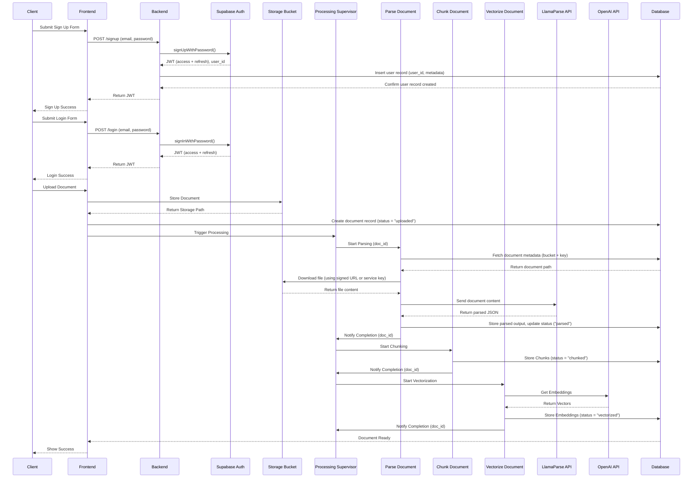

# 🚧 Supabase Database and System Rebuild Plan
**Version:** 1.0.0
**Date:** 2024-03-21
**Status:** Planning Phase - MVP with Scalability Path

## 📝 Context & Strategy

This plan outlines the development of an MVP that serves as the foundation for a HIPAA-compliant system. The approach balances rapid MVP delivery with building blocks for future scalability and compliance.

### 🎯 Development Philosophy
- **MVP First, Scalable Core**: Build core features quickly while establishing patterns for future scale
- **Local-First Development**: Use local backend + Supabase for rapid iteration
- **Compliance-Ready Architecture**: Design with HIPAA compliance in mind, even if not fully implemented in MVP
- **Progressive Enhancement**: Clear upgrade paths for each component

### 🌱 MVP to Production Evolution

#### Phase 1: MVP (Current Focus)
- Local backend coordinating with Supabase
- Basic auth and document processing
- Core security patterns established
- Essential monitoring

#### Phase 2: Production Readiness
- Enhanced security measures
- Full HIPAA compliance implementation
- Improved error handling
- Advanced monitoring

#### Phase 3: Scale & Optimize
- Performance optimizations
- Advanced caching
- Enhanced redundancy
- Compliance automation

## 🏗️ MVP Architecture

### Local Development Stack
```
Frontend (Next.js, 3000) → Backend (FastAPI, 8000) → Supabase (54321)
```

### Key Components
1. **Frontend**: Next.js application (existing)
2. **Backend**: FastAPI service for:
   - Coordinating with Supabase
   - Managing document processing flow
   - Handling auth flows
3. **Supabase**: 
   - User authentication
   - Document storage
   - Database operations
4. **Edge Functions**: 
   - Document processing pipeline
   - Vectorization services

## 📊 Database Schema (MVP)

### Core Tables
1. **users** (MVP + Scalable)
   ```sql
   - id: UUID, PK
   - email: string, unique, required
   - name: string, required
   - created_at: timestamp, default: now()
   - last_login: timestamp
   - session_expires: timestamp
   -- Future Fields for HIPAA:
   -- - consent_version: string
   -- - data_access_log: jsonb
   ```

2. **documents** (MVP + Scalable)
   ```sql
   - id: UUID, PK
   - user_id: UUID, FK to users(id)
   - filename: string, required
   - content_type: string
   - status: string (enum: ["processing", "completed", "error"])
   - created_at: timestamp, default: now()
   - updated_at: timestamp
   - storage_path: string
   - error_message: string, nullable
   -- Future Fields for HIPAA:
   -- - encryption_key_id: UUID
   -- - access_log: jsonb
   ```

### MVP Security Implementation
- Basic RLS policies
- Essential access controls
- Foundational audit logging

### Future Security Enhancements
- Enhanced encryption
- Comprehensive audit trails
- Advanced access controls
- HIPAA-compliant logging

## 🔄 MVP Processing Pipeline



## 📋 MVP Implementation and Deployment Checklist

### 1. Local Development Setup
- [x] Configure local FastAPI backend (8000)
- [x] Set up local Supabase instance (54321)
- [x] Initialize local frontend (3000)
- [x] Configure environment variables
- [x] Run integration tests to verify setup

### 2. Database Implementation
- [x] Create MVP schema
- [x] Implement basic RLS
- [x] Set up storage buckets
- [x] Document upgrade paths
- [x] Run schema validation tests
- [x] Run security audit tests
- [x] Deploy to production after approval

### 3. Backend Development
- [x] Set up FastAPI routes
- [x] Implement Supabase client
- [x] Create auth handlers
- [x] Add document processing coordination
- [x] Run unit tests for each component
  - [x] Supabase connection verification
  - [x] Client creation and error handling
  - [x] Environment configuration tests
  - [x] Auth handler tests
  - [x] Document processing tests
- [ ] Run end-to-end pipeline tests and security scans
  - [x] Test auth flow with production DB
  - [x] Test document upload and processing
  - [x] Run security vulnerability scan
  - [x] Verify HIPAA-readiness patterns
- [ ] Deploy to production
  - [ ] Create deployment checklist
  - [ ] Set up production monitoring
  - [ ] Configure alerting
  - [ ] Document rollback procedures

### 4. Edge Functions (MVP Version)
- [x] Basic processing supervisor
- [x] Document parser integration
- [x] Simple chunking service
- [x] Basic vectorization
- [x] Run local function tests
- [ ] Deploy to production
- [ ] Run end-to-end pipeline tests
- [ ] Verify production functionality

### 5. Frontend Integration
- [x] Connect to local backend
- [x] Implement auth flows
- [x] Add document upload
- [x] Show processing status
- [x] Run component tests
- [ ] Deploy to production
- [ ] Run accessibility tests
- [ ] Verify production functionality

### 6. Testing and Deployment Cycles
- [x] Local Testing
  - [x] Run after each component implementation
  - [x] Include unit tests and integration tests
  - [x] Fix issues before production deployment

- [ ] Production Deployment
  - [ ] Deploy after local testing passes
  - [ ] Run full integration test suite
  - [ ] Perform security scans
  - [ ] Conduct load testing
  - [ ] Monitor system metrics

### 7. Monitoring Setup
- [x] Set up error tracking
- [x] Configure performance monitoring
- [x] Implement security logging
- [x] Create alert thresholds
- [x] Test monitoring systems
- [x] Deploy monitoring to production

## 🚀 Development Workflow

### Local Development
1. Start Supabase
   ```bash
   supabase start
   ```

2. Start Backend
   ```bash
   uvicorn main:app --reload --port 8000
   ```

3. Start Frontend
   ```bash
   cd ui && npm run dev
   ```

### Testing Flow
1. Local component testing
2. Integration testing with local stack
3. Production verification tests

## 📈 MVP Success Criteria

### Functional
- Complete auth flow works
- Documents upload successfully
- Processing pipeline executes
- Frontend shows status updates

### Technical
- Local development stack runs smoothly
- Basic security measures in place
- Error handling works
- Monitoring captures essential data

### Future-Proofing
- Clear upgrade paths documented
- HIPAA compliance gaps identified
- Scalability bottlenecks noted
- Security enhancement plan ready

## 🔄 Immediate Next Steps

1. Set up local development environment
2. Create database schema with upgrade paths
3. Implement FastAPI backend coordination
4. Develop first Edge Function
5. Test auth flow end-to-end

## 📚 Resources & Documentation

- [Supabase Local Dev](https://supabase.com/docs/guides/local-development)
- [FastAPI Documentation](https://fastapi.tiangolo.com/)
- [Edge Functions Guide](https://supabase.com/docs/guides/functions)
- [Next.js Integration](https://supabase.com/docs/guides/getting-started/quickstarts/nextjs)

## 🔍 Future Considerations

### Security Enhancements
- Full HIPAA compliance implementation
- Enhanced encryption at rest
- Advanced audit logging
- Access control matrices

### Scalability Improvements
- Caching layers
- Rate limiting
- Load balancing
- Redundancy

### Monitoring Upgrades
- Advanced error tracking
- Performance monitoring
- Security alerts
- Compliance reporting

## 📝 Decision Log

1. **Local Backend + Supabase**: 
   - Enables rapid development
   - Maintains deployment flexibility
   - Simplifies testing

2. **FastAPI Coordination**:
   - Provides upgrade path to microservices
   - Enables local testing
   - Maintains deployment options

3. **Security Implementation**:
   - Start with essential security
   - Document compliance gaps
   - Plan enhancement phases

4. **Processing Pipeline**:
   - Build for current scale
   - Design for future volume
   - Enable easy upgrades
```