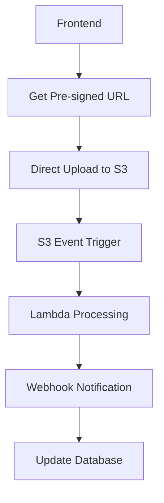

# Upload Resilience Strategy

## Problem Analysis

### Current Issue: Backend Crashes During Heavy PDF Processing

**Symptoms:**
- 502 Bad Gateway errors during large file uploads
- Server restarts after 3-4 minutes of intensive processing
- CORS failures as secondary effect (no headers sent when server crashes)

**Root Cause:**
- Synchronous processing blocks main thread for minutes
- Memory exhaustion from loading entire documents + embeddings
- No timeout handling or resource limits
- Single-threaded processing architecture

## Immediate Solutions (Next 2 Weeks)

### 1. Asynchronous Processing with Queue System
```python
# Convert to async background processing
@app.post("/upload-policy")
async def upload_policy_async(file: UploadFile):
    # Quick response to client
    document_id = generate_uuid()
    
    # Queue for background processing
    await queue_processor.enqueue({
        'document_id': document_id,
        'file_data': file,
        'status': 'queued'
    })
    
    return {
        'document_id': document_id,
        'status': 'processing',
        'estimated_completion': '2-5 minutes'
    }

# Separate worker process
async def process_document_worker(task):
    try:
        # Process in chunks with memory management
        await process_document_with_limits(task)
    except Exception as e:
        await update_status(task['document_id'], 'failed', str(e))
```

### 2. Memory-Efficient Streaming Processing
```python
# Instead of loading everything in memory
def process_pdf_streaming(file_path: str):
    with open(file_path, 'rb') as f:
        reader = PyPDF2.PdfReader(f)
        
        # Process page by page
        for page_num, page in enumerate(reader.pages):
            text = page.extract_text()
            
            # Process immediately, don't accumulate
            yield process_page_chunk(text, page_num)
            
            # Memory cleanup
            if page_num % 10 == 0:
                gc.collect()
```

### 3. Resource Limits and Circuit Breakers
```python
# Add resource monitoring
class ResourceMonitor:
    def __init__(self):
        self.max_memory_mb = 1500
        self.max_processing_time = 300  # 5 minutes
        
    async def check_resources(self):
        memory_usage = psutil.Process().memory_info().rss / 1024 / 1024
        if memory_usage > self.max_memory_mb:
            raise ResourceExhaustionError("Memory limit exceeded")
```

## Long-term Architecture (Next 1-2 Months)

### 1. Microservices with Direct Storage Upload

Based on the research from [AWS S3 heavy uploads](https://sandydev.medium.com/how-to-handle-heavy-uploads-in-backend-best-approach-a71079e4f01f), implement:



**Benefits:**
- **No server load** during upload
- **Automatic scaling** with Lambda
- **Cost efficiency** (pay per use)
- **Reliability** (AWS handles infrastructure)

### 2. Lambda-based Processing Architecture

Following the [AWS Lambda large file processing](https://articles.wesionary.team/mastering-large-file-processing-with-aws-s3-lambda-and-go-3dde0a4c29c6) pattern:

```python
# Lambda function for different file sizes
def lambda_handler(event, context):
    bucket = event['Records'][0]['s3']['bucket']['name']
    key = event['Records'][0]['s3']['object']['key']
    
    # Stream processing with Go concurrency patterns
    with pipe_reader_writer() as (reader, writer):
        # Concurrent processing
        asyncio.gather(
            extract_text_stream(reader),
            generate_embeddings_stream(writer),
            chunk_content_stream()
        )
```

### 3. Progressive Enhancement Strategy

**Phase 1: Immediate (This Week)**
- ✅ Fix CORS error messages (Done)
- ✅ Add automated CORS monitoring (Done)
- 🔄 Implement file size limits (10MB → 25MB gradually)
- 🔄 Add async processing queue

**Phase 2: Short-term (2 Weeks)**
- 🔄 Memory-efficient streaming
- 🔄 Resource monitoring and limits
- 🔄 Progress tracking for users
- 🔄 Graceful degradation

**Phase 3: Long-term (1-2 Months)**
- 🔄 Direct S3 uploads with pre-signed URLs
- 🔄 Lambda-based processing
- 🔄 WebSocket progress updates
- 🔄 Multi-region deployment

## Immediate Next Steps

### 1. Add Upload Size Management
```python
# Gradual rollout of larger files
FILE_SIZE_LIMITS = {
    'small': 10 * 1024 * 1024,    # 10MB (current)
    'medium': 25 * 1024 * 1024,   # 25MB (next week)
    'large': 50 * 1024 * 1024,    # 50MB (month 2)
}

def get_current_limit():
    # Feature flag based rollout
    return FILE_SIZE_LIMITS['small']  # Start conservative
```

### 2. Implement Processing Queue
```bash
# Add Redis for queue management
pip install celery redis

# Start background workers
celery -A main.celery worker --loglevel=info
```

### 3. Add Progress Tracking
```python
# Real-time status updates
@app.get("/upload-status/{document_id}")
async def get_upload_status(document_id: str):
    status = await get_processing_status(document_id)
    return {
        'status': status.state,  # 'queued', 'processing', 'complete', 'failed'
        'progress': status.progress,  # 0-100
        'stage': status.current_stage,  # 'extracting', 'chunking', 'embedding'
        'estimated_completion': status.eta
    }
```

## Will This Happen Every Time?

**Currently: YES** - Any file that takes more than ~3-4 minutes to process will crash the server.

**After Immediate Fixes: RARELY** - Only extremely large files or server overload.

**After Long-term Architecture: NO** - Designed to handle multi-GB files reliably.

## Success Metrics

- **Immediate**: 0 server crashes during file processing
- **Short-term**: Handle 25MB files without issues
- **Long-term**: Process 100MB+ files with <1% failure rate

## Cost Analysis

**Current**: Free Render tier (512MB RAM) - crashes frequently
**Immediate**: $7/month Render (1GB RAM) - handles most cases
**Long-term**: AWS Lambda + S3 - $0.01 per file processed (scales infinitely)

The key insight: **Don't make your backend stronger, make it smarter** by offloading heavy work to purpose-built services. 