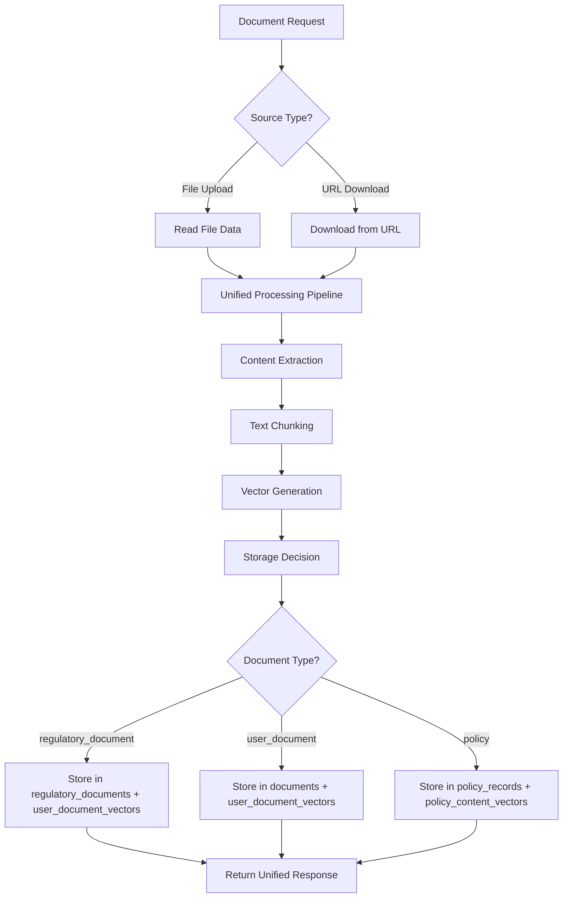

# Unified Document Processing API Implementation

## Overview

This implementation creates a **Unified API** following the [industry pattern](https://www.apideck.com/blog/what-is-a-unified-api) where we "aggregate many APIs in the same software category, making integration easier with a standard endpoint, authentication, and normalized data."

Instead of creating separate pipelines for user documents vs. regulatory documents, we've **extended your existing document processing infrastructure** to handle both through the same unified system.

## Architecture

### Unified API Pattern Benefits

✅ **Single Processing Pipeline** - All documents (user uploads, regulatory URLs, policies) go through the same proven pipeline
✅ **Consistent Developer Experience** - Same authentication, error handling, and response format  
✅ **Normalized Data Storage** - Documents stored with consistent metadata regardless of source
✅ **Reduced Maintenance** - One codebase to maintain instead of multiple separate systems
✅ **Future-Proof** - Easy to add new document types (claims, provider directories, etc.)

### Pipeline Flow



## New API Endpoints

### 1. `/api/documents/upload-regulatory`

**Purpose**: Upload regulatory documents via URL through the unified pipeline

```python
POST /api/documents/upload-regulatory
Content-Type: application/json
Authorization: Bearer <token>

{
    "source_url": "https://cms.gov/guidance.pdf",
    "title": "CMS Access Guidelines", 
    "document_type": "regulatory_document",
    "jurisdiction": "federal",
    "program": ["medicaid"],
    "metadata": {
        "category": "access_standards",
        "effective_date": "2025-01-01"
    }
}
```

### 2. `/api/documents/upload-unified`

**Purpose**: Universal document endpoint supporting both file uploads and URL downloads

```python
POST /api/documents/upload-unified
Content-Type: multipart/form-data
Authorization: Bearer <token>

# For File Upload:
file: <binary_file_data>
request_data: {
    "document_type": "user_document",
    "source_type": "file_upload", 
    "metadata": {...}
}

# For URL Download:
request_data: {
    "document_type": "regulatory_document",
    "source_type": "url_download",
    "source_url": "https://...",
    "title": "Document Title",
    "metadata": {...}
}
```

## Integration with Existing Systems

### Leveraged Existing Components

1. **StorageService** - Reused `upload_user_document_with_vectors()` method
2. **EncryptionAwareEmbeddingService** - Existing vector generation and storage
3. **Edge Functions** - Same content extraction pipeline (doc-parser, vector-processor)
4. **Database Schema** - Extended existing tables rather than creating new ones

### Enhanced Components

1. **Document Metadata** - Added `document_source_type` to distinguish document origins
2. **Vector Storage** - Enhanced to support regulatory document references
3. **Response Models** - Unified response format across all document types

## Usage Examples

### Python Script Integration

```python
import asyncio
import aiohttp

async def upload_regulatory_documents():
    async with aiohttp.ClientSession() as session:
        # Authenticate
        auth_response = await session.post(f"{backend_url}/login", json={
            "email": "admin@example.com",
            "password": "password"
        })
        auth_data = await auth_response.json()
        token = auth_data['access_token']
        
        # Upload regulatory document
        headers = {'Authorization': f'Bearer {token}'}
        payload = {
            "source_url": "https://cms.gov/document.pdf",
            "title": "Healthcare Access Standards",
            "document_type": "regulatory_document",
            "jurisdiction": "federal",
            "program": ["medicaid"]
        }
        
        response = await session.post(
            f"{backend_url}/api/documents/upload-regulatory",
            json=payload,
            headers=headers
        )
        
        result = await response.json()
        print(f"Document ID: {result['document_id']}")
        print(f"Vectors Generated: {result['estimated_vectors']}")
```

### Frontend Integration

```javascript
// Upload regulatory document via frontend
const uploadRegulatoryDoc = async (docData) => {
    const response = await fetch('/api/documents/upload-regulatory', {
        method: 'POST',
        headers: {
            'Content-Type': 'application/json',
            'Authorization': `Bearer ${userToken}`
        },
        body: JSON.stringify({
            source_url: docData.url,
            title: docData.title,
            document_type: 'regulatory_document',
            jurisdiction: docData.jurisdiction,
            program: docData.programs
        })
    });
    
    return await response.json();
};

// Upload user document via unified endpoint
const uploadUserDoc = async (file, metadata) => {
    const formData = new FormData();
    formData.append('file', file);
    formData.append('request_data', JSON.stringify({
        document_type: 'user_document',
        source_type: 'file_upload',
        metadata: metadata
    }));
    
    const response = await fetch('/api/documents/upload-unified', {
        method: 'POST',
        headers: {
            'Authorization': `Bearer ${userToken}`
        },
        body: formData
    });
    
    return await response.json();
};
```

## Database Impact

### Enhanced Tables

1. **user_document_vectors**
   - Added `document_source_type` field
   - Added `regulatory_document_id` foreign key
   - Supports both user and regulatory document vectors

2. **regulatory_documents** 
   - Links to user_document_vectors via `regulatory_document_id`
   - Maintains regulatory-specific metadata

### Query Examples

```sql
-- Find all regulatory document vectors
SELECT udv.*, rd.title, rd.jurisdiction 
FROM user_document_vectors udv
JOIN regulatory_documents rd ON udv.regulatory_document_id = rd.document_id
WHERE udv.document_source_type = 'regulatory_document';

-- Semantic search across all document types
SELECT content, similarity_score, document_source_type
FROM user_document_vectors 
WHERE content_embedding <=> $1 < 0.8
ORDER BY content_embedding <=> $1 
LIMIT 10;
```

## Testing and Deployment

### Test Suite

1. **API Availability Test** - `test_unified_api.py`
2. **Batch Upload Test** - `unified_regulatory_uploader.py`  
3. **Vector Verification** - `check_vector_pipeline_status_fixed.py`

### Deployment Steps

```bash
# 1. Start your backend server
python main.py

# 2. Test API endpoints
python test_unified_api.py

# 3. Upload regulatory documents
python unified_regulatory_uploader.py

# 4. Verify vector generation
python check_vector_pipeline_status_fixed.py
```

## Benefits Achieved

### 🔄 **Reused Existing Infrastructure**
- No need to rebuild content extraction, chunking, or vector generation
- Leverages proven Edge Functions pipeline
- Maintains existing security and authentication

### 📊 **Consistent Data Model**
- All vectors stored in same table structure
- Unified search across user and regulatory documents
- Consistent metadata format

### 🚀 **Easy Extension**
- Add new document types by extending the `document_type` enum
- Support new source types (APIs, email attachments, etc.)
- Maintain single codebase

### 🔍 **Enhanced RAG Capabilities**
- Seamless semantic search across all document types
- Context-aware responses using both user and regulatory data
- Improved coverage for complex healthcare queries

## Future Enhancements

1. **Additional Document Types**
   - Provider directories
   - Claims documentation  
   - Clinical guidelines
   - Insurance plan documents

2. **Enhanced Source Types**
   - API integrations (HL7 FHIR, etc.)
   - Email attachments
   - Scheduled URL monitoring
   - Real-time data feeds

3. **Advanced Processing**
   - Document versioning
   - Change detection
   - Automated compliance checking
   - Multi-language support

## Conclusion

This **Unified API implementation** successfully extends your existing document processing pipeline to handle regulatory documents without duplicating infrastructure. It follows industry best practices for API design while maintaining the robustness and security of your current system.

The approach demonstrates how to build **scalable, maintainable systems** that can grow with your needs while preserving the investments you've already made in your existing architecture. 