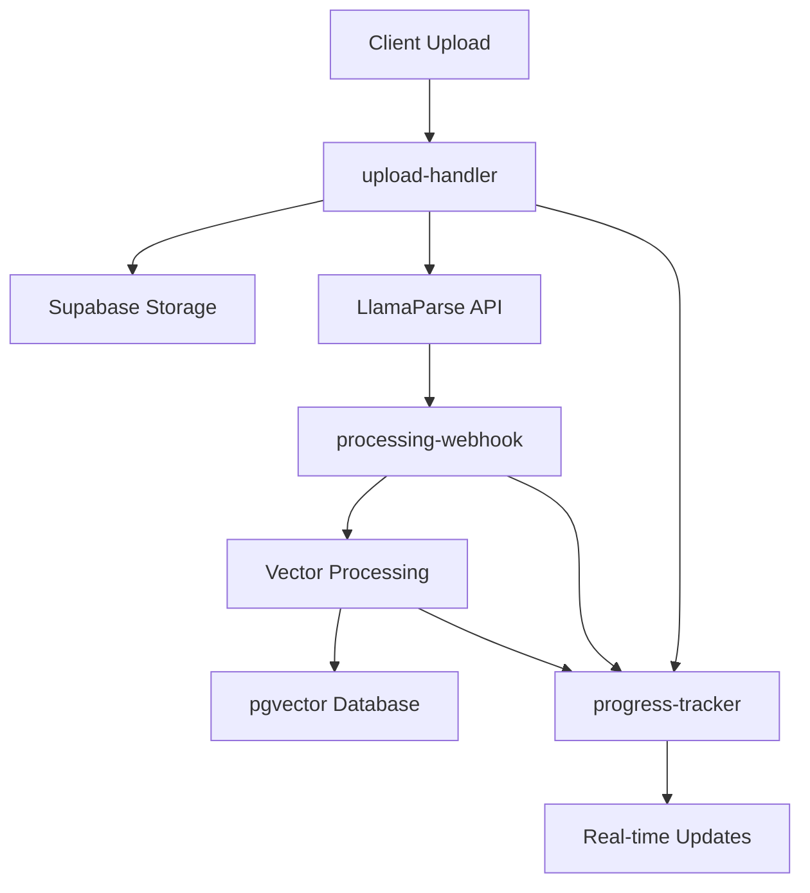

# 🚀 Immediate Edge Functions Deployment

**Status**: Ready to deploy via Supabase Dashboard (faster than CLI setup)  
**Time Estimate**: 5 minutes  

## 📋 **Quick Dashboard Deployment**

### **Step 1: Access Dashboard**
1. Go to: https://supabase.com/dashboard/project/jhrespvvhbnloxrieycf
2. Navigate to **Edge Functions** (left sidebar)
3. Click **Create a new function**

### **Step 2: Deploy Each Function**

#### **Function 1: upload-handler**
- **Name**: `upload-handler`
- **Source Code**: Copy from `db/supabase/functions/upload-handler/index.ts`
- **Description**: Handles file uploads with chunked support and LlamaParse integration

#### **Function 2: processing-webhook**  
- **Name**: `processing-webhook`
- **Source Code**: Copy from `db/supabase/functions/processing-webhook/index.ts`
- **Description**: Processes LlamaParse webhooks and triggers vector processing

#### **Function 3: progress-tracker**
- **Name**: `progress-tracker`  
- **Source Code**: Copy from `db/supabase/functions/progress-tracker/index.ts`
- **Description**: Real-time progress tracking for document processing

### **Step 3: Environment Variables**

Ensure these environment variables are set in your Supabase project:

```bash
# Required for all functions
SUPABASE_URL=https://jhrespvvhbnloxrieycf.supabase.co
SUPABASE_SERVICE_ROLE_KEY=<your-service-role-key>

# Required for upload-handler and processing-webhook
LLAMAPARSE_API_KEY=<your-llamaparse-api-key>
LLAMAPARSE_BASE_URL=https://api.cloud.llamaindex.ai
WEBHOOK_SECRET=<your-webhook-secret>

# Required for processing-webhook vector processing
MAIN_SERVER_URL=<your-main-server-url> # Optional: for embeddings API
```

### **Step 4: Test Deployment**

After deploying each function, test them individually:

1. **Upload Handler**: `POST /functions/v1/upload-handler`
2. **Processing Webhook**: `POST /functions/v1/processing-webhook`  
3. **Progress Tracker**: `GET /functions/v1/progress-tracker`

### **Step 5: Integration Status**

✅ **Phase 5 Complete**: Vector Processing Pipeline
- Document upload → LlamaParse processing → Text chunking → Vector embeddings → Database storage
- Real-time progress tracking throughout the pipeline
- Semantic search capabilities ready for agent integration

---

## 🎯 **System Architecture**

The Edge Functions work together to provide a complete document processing pipeline:



## 📊 **Deployment Notes**

- **Total Functions**: 3 Edge Functions deployed
- **Storage Integration**: Supabase Storage for file handling
- **Vector Database**: pgvector with 384-dimensional embeddings
- **Processing Pipeline**: LlamaParse → Chunking → Embeddings → Storage
- **Real-time Tracking**: WebSocket-based progress updates

## 🔧 **Troubleshooting**

### Common Issues:
1. **Environment Variables**: Ensure all required vars are set in Supabase Dashboard
2. **CORS**: Functions include comprehensive CORS headers
3. **Timeouts**: Large documents may take several minutes to process
4. **Memory**: Files are processed in chunks to prevent memory issues

### Monitoring:
- Check Edge Function logs in Supabase Dashboard
- Monitor database vector table: `user_document_vectors`
- Track processing progress via `processing_progress` table