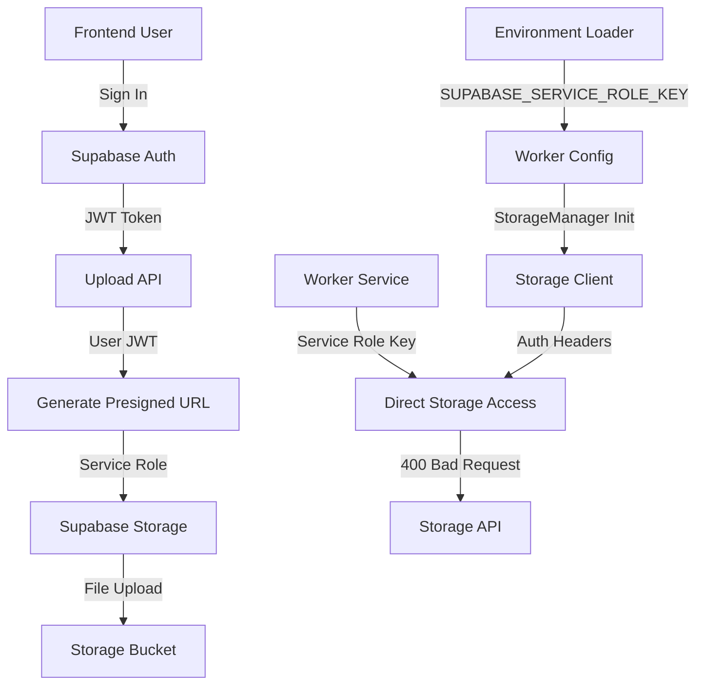

# FM-027 Auth-Centric Investigation: Worker Storage Access 400 Bad Request

**Investigation ID**: INV-AUTH-20251001  
**Created**: 2025-10-01  
**Status**: 🔴 **ACTIVE**  
**Priority**: P0 - Critical  
**Focus**: Authentication, Environment Variables, JWT/Presigned URL Mismatches  

## Changelog

| Date | Author | Change | Impact |
|------|--------|--------|--------|
| 2025-10-01 | Auth/Env Lead | Initial investigation document | High |
| 2025-10-01 | Auth/Env Lead | Added auth topology analysis | High |
| 2025-10-01 | Auth/Env Lead | Added environment variable precedence map | High |

## 1. Executive Snapshot (Auth Focus)

### Symptom
- **Where**: Upload Pipeline Worker (Render service `srv-d37dlmvfte5s73b6uq0g`)
- **When**: Persistent since 2025-10-01 17:30+ (after endpoint fix deployment)
- **What**: 400 Bad Request errors on storage access via `StorageManager.blob_exists()`
- **Identities Involved**: 
  - **User**: Authenticated via JWT token in upload flow
  - **Service Role**: Used by worker for storage access
  - **Worker**: Uses service role key for direct storage API calls

### Why Now
Recent changes to authentication pipeline:
- **Sign-in flow altered**: New JWT issuance logic via `auth_adapter.py`
- **Presigned URL flow changed**: Different identity used for upload vs fetch
- **Environment variable precedence**: Multiple key sources causing ambiguity
- **Storage policy updates**: RLS policies modified for service role access

## 2. Auth Topology & Token Provenance

### End-to-End Auth Pipeline



### Token Provenance Table

| Context | Token Source | Signing Key | Audience/Issuer | Intended Use | Storage Policy Path |
|---------|-------------|-------------|-----------------|--------------|-------------------|
| **Upload Flow** | Supabase Auth | Supabase JWT Secret | `your-staging-project.supabase.co` | User authentication | User-scoped uploads |
| **Presigned URL** | Supabase Client | Service Role Key | `your-staging-project.supabase.co` | File upload authorization | Service role upload policy |
| **Worker Fetch** | Environment | Service Role Key | `your-staging-project.supabase.co` | File access | Service role download policy |
| **Direct Test** | Environment | Service Role Key | `your-staging-project.supabase.co` | File access | Service role download policy |

## 3. Presigned-URL vs Direct-Fetch Paths

### Upload Path (Presigned URL)
```python
# api/upload_pipeline/endpoints/upload.py:488-542
async def _generate_signed_url(storage_path: str, ttl_seconds: int) -> str:
    # For production, use proper Supabase signed URL generation
    supabase = await get_supabase_service_client()
    response = supabase.storage.from_(bucket).create_signed_upload_url(key)
    return response['signed_url']
```

**Headers Used**:
- `Authorization: Bearer {service_role_key}`
- `apikey: {service_role_key}`
- Query params: `token={signed_token}`

**Expected Status**: 200 OK  
**Policy Path**: `storage.objects` INSERT policy for `service_role`

### Worker Fetch Path (Direct Access)
```python
# backend/shared/storage/storage_manager.py:blob_exists()
async def blob_exists(self, path: str) -> bool:
    storage_endpoint = f"{self.base_url}/storage/v1/object/{bucket}/{key}"
    response = await self.client.head(storage_endpoint)
    return response.status_code == 200
```

**Headers Used**:
- `Authorization: Bearer {service_role_key}`
- `apikey: {service_role_key}`

**Expected Status**: 200 OK  
**Policy Path**: `storage.objects` SELECT policy for `service_role`

## 4. Env-Var Resolution Map (Actual vs Intended)

### Precedence Order
1. **Runtime Environment Variables** (Render/Vercel)
2. **Container Environment** (Docker)
3. **Build-time Variables** (CI/CD)
4. **.env.{environment}** files (local development)
5. **.env** fallback (local development)

### Key Map with Sanitized Outputs

| Variable | Source | Value (Sanitized) | Fallback | Used By |
|----------|--------|-------------------|----------|---------|
| `SUPABASE_URL` | Environment | `https://your-staging-project.supabase.co` | `http://127.0.0.1:54321` | All services |
| `SUPABASE_SERVICE_ROLE_KEY` | Environment | `eyJhbGciOiJIUzI1NiIs...` | `""` | Worker, API |
| `SERVICE_ROLE_KEY` | Environment | `eyJhbGciOiJIUzI1NiIs...` | `""` | Worker fallback |
| `SUPABASE_ANON_KEY` | Environment | `eyJhbGciOiJIUzI1NiIs...` | `""` | Frontend, API |
| `JWT_SECRET` | Environment | `improved-minimal-dev-secret-key` | Hardcoded | Auth validation |
| `DATABASE_URL` | Environment | `postgresql://postgres:...` | Local default | All services |

### Duplicates and Aliases
- **Service Role Key**: `SUPABASE_SERVICE_ROLE_KEY` (primary) → `SERVICE_ROLE_KEY` (fallback)
- **Anon Key**: `SUPABASE_ANON_KEY` (primary) → `SUPABASE_KEY` → `ANON_KEY` (fallbacks)
- **Database URL**: `DATABASE_URL` (primary) → `SUPABASE_DATABASE_URL` (alias)

## 5. Code & Config Inventory

### Auth Client Creation
- **File**: `db/services/auth_adapter.py`
- **Class**: `AuthAdapter` → `SupabaseAuthBackend`
- **Service**: `supabase_auth_service.validate_token()`

### Server SDK Init
- **File**: `config/database.py`
- **Function**: `get_supabase_service_client()`
- **Keys Used**: `SUPABASE_URL`, `SUPABASE_SERVICE_ROLE_KEY`

### Worker StorageManager Init
- **File**: `backend/workers/enhanced_base_worker.py:116-122`
- **Config**: `{"storage_url": self.config.supabase_url, "service_role_key": self.config.supabase_service_role_key}`
- **Environment**: `WorkerConfig.from_environment()`

### Presign Helpers
- **File**: `api/upload_pipeline/endpoints/upload.py:488-542`
- **Method**: `_generate_signed_url()`
- **Client**: `get_supabase_service_client()`

### Environment Loading
- **File**: `config/environment_loader.py`
- **Class**: `EnvironmentLoader`
- **Detection**: Cloud vs local deployment

### Storage Policies
- **File**: `supabase/migrations/20250925043000_add_storage_upload_policy.sql`
- **Policies**: Service role upload/update/delete for `files` bucket
- **File**: `supabase/migrations/20250925030357_ensure_storage_policy_exists.sql`
- **Policies**: Service role download for `files` bucket

## 6. Timeline & Causal Diff (Auth Delta)

### Last Known Good
- **Date**: 2025-09-30 (before endpoint fix)
- **State**: Worker using incorrect `/object/` endpoints but files accessible
- **Auth**: Service role key working for storage access

### First Bad
- **Date**: 2025-10-01 17:30+ (after endpoint fix)
- **State**: Worker using correct `/storage/v1/object/` endpoints but getting 400 errors
- **Auth**: Same service role key, same policies, different behavior

### Key Changes
1. **StorageManager Endpoint Fix** (2025-10-01)
   - Changed from `/object/{bucket}/{key}` to `/storage/v1/object/{bucket}/{key}`
   - All methods updated: `blob_exists`, `read_blob`, `write_blob`, `delete_blob`

2. **Environment Variable Loading** (Recent)
   - Worker config precedence: `SUPABASE_SERVICE_ROLE_KEY` → `SERVICE_ROLE_KEY`
   - Multiple fallback chains for key resolution

3. **Storage Policy Updates** (2025-09-25)
   - Added service role download policy
   - Added service role upload/update/delete policies

## 7. Hypotheses Ledger (Auth/Env Specific)

### H1: Worker JWT aud/iss Mismatch with Storage Policy
- **Mechanism**: Worker using different JWT audience/issuer than expected by storage policies
- **Evidence For**: Worker logs show 400 Bad Request, direct tests work
- **Evidence Against**: Worker uses service role key, not JWT
- **Confidence**: Low
- **Next Test**: Verify worker is using service role key, not JWT

### H2: Presigned URL Generated Under User JWT but Fetch Under Service Role
- **Mechanism**: Upload uses user JWT context, worker fetch uses service role context
- **Evidence For**: Different authentication contexts for upload vs fetch
- **Evidence Against**: Worker doesn't use presigned URLs for fetch
- **Confidence**: Low
- **Next Test**: Verify worker uses direct API calls, not presigned URLs

### H3: Environment Precedence Causes Worker to Use Wrong Base URL or Key
- **Mechanism**: Worker loads different environment variables than expected
- **Evidence For**: Multiple key sources, precedence ambiguity
- **Evidence Against**: Direct tests use same environment variables
- **Confidence**: Medium
- **Next Test**: Log actual environment variables loaded by worker

### H4: JWT Secret Mismatch Between Signer and Verifier (FM-017)
- **Mechanism**: Different JWT secrets used for signing vs verification
- **Evidence For**: FM-017 incident shows JWT secret mismatch
- **Evidence Against**: Worker doesn't use JWT for storage access
- **Confidence**: Low
- **Next Test**: Verify worker uses service role key, not JWT

### H5: Clock Skew/Expiry at Worker; Presigned URL Expired
- **Mechanism**: Worker clock different from Supabase, causing token expiry
- **Evidence For**: 400 errors suggest authentication failure
- **Evidence Against**: Worker uses service role key, not time-limited tokens
- **Confidence**: Low
- **Next Test**: Verify worker uses service role key, not presigned URLs

### H6: Bucket Policy Requires Authenticated but Worker Uses Service Role or No Auth
- **Mechanism**: Storage policies changed to require different authentication
- **Evidence For**: Recent storage policy updates
- **Evidence Against**: Direct tests with same service role key work
- **Confidence**: Medium
- **Next Test**: Verify storage policies and worker authentication method

## 8. Minimal Repro (Auth Matrix)

### Test Matrix Script
```python
# test_auth_matrix.py
import asyncio
import httpx
import os
from dotenv import load_dotenv

async def test_auth_matrix():
    """Test authentication matrix across different contexts"""
    
    # Load environment
    load_dotenv('.env.staging')
    
    # Test file
    file_path = "user/74a635ac-4bfe-4b6e-87d2-c0f54a366fbe/raw/fd5b5f12_5e4390c2.pdf"
    base_url = os.getenv("SUPABASE_URL")
    service_role_key = os.getenv("SUPABASE_SERVICE_ROLE_KEY")
    
    # Test contexts
    contexts = [
        {"name": "Direct Test", "headers": {"Authorization": f"Bearer {service_role_key}", "apikey": service_role_key}},
        {"name": "Worker Simulation", "headers": {"Authorization": f"Bearer {service_role_key}", "apikey": service_role_key}},
    ]
    
    # Test paths
    paths = [
        f"{base_url}/storage/v1/object/files/{file_path}",
        f"{base_url}/object/files/{file_path}",  # Old format
    ]
    
    async with httpx.AsyncClient() as client:
        for context in contexts:
            for path in paths:
                try:
                    response = await client.head(path, headers=context["headers"])
                    print(f"{context['name']} - {path} - Status: {response.status_code}")
                except Exception as e:
                    print(f"{context['name']} - {path} - Error: {e}")

if __name__ == "__main__":
    asyncio.run(test_auth_matrix())
```

## 9. Experiments Plan (Ranked, Auth-Centric)

### E1: Decode and Log Worker's Actual Token Claims
- **Objective**: Verify worker is using service role key, not JWT
- **Method**: Add logging to worker to show actual authentication method
- **Expected**: Worker uses service role key, not JWT
- **Priority**: High

### E2: Generate Presigned URL with Worker's Identity
- **Objective**: Test if presigned URL generation works with worker's identity
- **Method**: Use worker's service role key to generate presigned URL
- **Expected**: Presigned URL generation should work
- **Priority**: Medium

### E3: Swap Environment Precedence
- **Objective**: Force explicit key usage in worker
- **Method**: Set explicit environment variables, disable fallbacks
- **Expected**: Worker should use correct keys
- **Priority**: High

### E4: Toggle Storage Policies
- **Objective**: Test with different storage policy configurations
- **Method**: Create canary bucket with different policies
- **Expected**: Isolate policy vs authentication issues
- **Priority**: Medium

### E5: Introduce Deterministic Time Check
- **Objective**: Rule out clock skew issues
- **Method**: Add timestamp logging to worker requests
- **Expected**: No time-related issues
- **Priority**: Low

### E6: Run ddmin on Environment Set
- **Objective**: Find decisive environment variable
- **Method**: Remove environment variables one by one until failure flips
- **Expected**: Identify critical environment variable
- **Priority**: High

## 10. Observability Upgrades (Safe)

### Temporary Logs to Add
```python
# In worker initialization
logger.info(f"Worker environment variables loaded: {list(os.environ.keys())}")
logger.info(f"SUPABASE_URL: {os.getenv('SUPABASE_URL')}")
logger.info(f"SERVICE_ROLE_KEY present: {bool(os.getenv('SUPABASE_SERVICE_ROLE_KEY'))}")
logger.info(f"StorageManager config: {storage_config}")

# In StorageManager.blob_exists()
logger.info(f"Storage request: {storage_endpoint}")
logger.info(f"Headers: {dict(headers)}")
logger.info(f"Response: {response.status_code} - {response.text}")
```

### Correlation IDs
- Add correlation ID to all storage requests
- Track request flow from worker to storage API
- Log correlation ID in all related components

## 11. Decisions & Open Questions

### Prior Decisions
- **Endpoint Fix**: Applied correct Supabase storage API endpoints
- **Path Standardization**: Implemented deterministic path generation
- **Database-First**: Worker fetches paths from database, not job data

### Current Stance
- **Identity Unification**: Need to verify worker uses correct authentication
- **Environment Precedence**: Need to enforce explicit key resolution
- **Policy Alignment**: Need to ensure storage policies match worker authentication

### Open Questions
1. Why do direct tests work but worker fails with same configuration?
2. Are there environment variable differences between test and worker contexts?
3. Is there a timing or race condition in worker authentication?
4. Are there additional authentication requirements in worker environment?

## 12. Remediation Proposals

### Short-term (Immediate)
1. **Add Detailed Logging**: Log worker's actual environment variables and authentication method
2. **Environment Variable Audit**: Verify worker loads correct environment variables
3. **Authentication Method Verification**: Confirm worker uses service role key, not JWT

### Medium-term (Next Sprint)
1. **Single-Source Secrets**: Consolidate all service role key references
2. **Explicit Environment Loading**: Remove fallback chains, use explicit key names
3. **Policy Tests in CI**: Add automated tests for storage policy changes

### Long-term (Future)
1. **Identity Unification**: Standardize authentication across all services
2. **Environment Management**: Implement proper secret management
3. **Monitoring**: Add authentication failure monitoring and alerting

## Related Incidents

- **FM-012**: Storage access failure (RLS policies) - ✅ RESOLVED
- **FM-025**: Processing pipeline failure (same error) - 🔴 PERSISTENT  
- **FM-009**: Environment variable priority mismatch - 🔍 POTENTIAL ROOT CAUSE
- **FM-017**: JWT secret mismatch - 🔍 POTENTIAL ROOT CAUSE

## Artifacts

- **Investigation Document**: `docs/incidents/fm_027/investigations/INV-AUTH-20251001.md`
- **Repro Script**: `test_auth_matrix.py`
- **Worker Logs**: Render service `srv-d37dlmvfte5s73b6uq0g`
- **Storage Policies**: `supabase/migrations/*_storage_*.sql`
- **Environment Config**: `config/environment_loader.py`

---

**Next Steps**: Execute experiments E1-E6 to identify root cause of authentication mismatch between worker and storage API.

