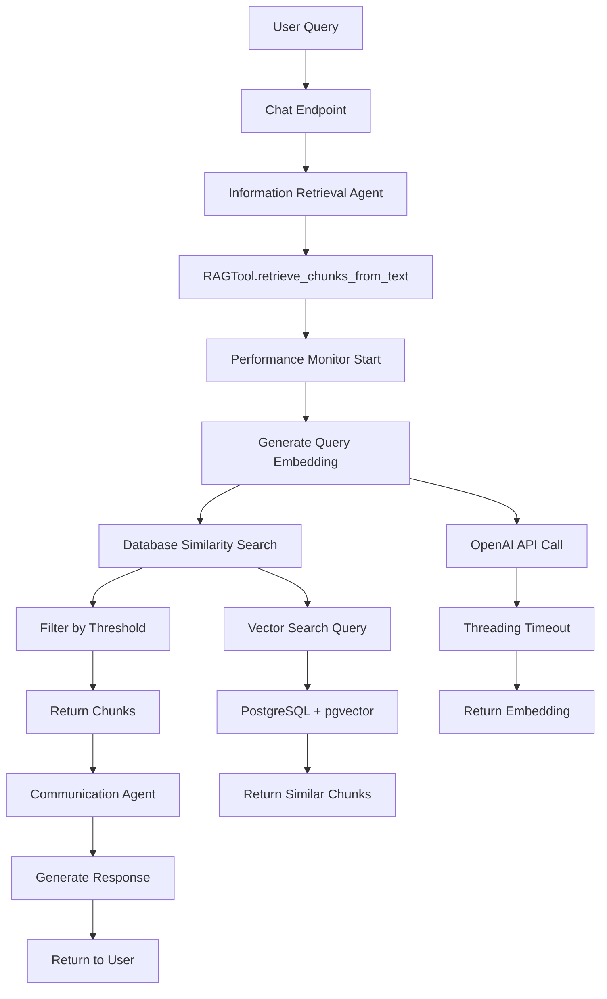

# FM-038: Complete Investigation History & Debugging Notebook Prompt

**Date:** 2025-10-09  
**Status:** 🔴 **CRITICAL - INVESTIGATION REQUIRED**  
**Incident:** FM-038 - RAG Operations Returning Zero Chunks  
**Document Type:** Investigation History & Debugging Instructions

---

## Executive Summary

This document provides a complete history of all corrective actions attempted for FM-038, their outcomes, and instructions for creating a step-by-step debugging notebook to identify the root cause of RAG operations returning zero chunks.

**Latest Evidence (2025-10-09 12:32:54):**
```
RAG Operation Started [7ab964f3-28c4-4331-9385-6a868937d386]
user_id: cae3b3ec-b355-4509-bd4e-0f7da8cb2858
query_text: "To access mental health services..."
[NO COMPLETION LOG - Still hanging or taking longer than expected]
```

**Key Observation:** Only one RAG call this time, and it appears to be hanging again (no completion log after several minutes).

---

## Complete Investigation History

### Phase 1: Original Hanging Issue (2025-10-08)

#### Problem Description
- **Symptom**: RAG operations hanging for 120 seconds, then timing out
- **Evidence**: `Chat processing timed out after 120 seconds`
- **Impact**: 100% of users affected, complete RAG failure

#### Corrective Action 1: Threading-Based Timeout
**Date:** 2025-10-08 (commit `b26150a`)  
**Action:** Implemented threading-based timeout for OpenAI API calls  
**Implementation:**
```python
def api_call():
    response = client.embeddings.create(...)  # ❌ NO await!
    result_queue.put(response)

thread = threading.Thread(target=api_call)
thread.join(timeout=25.0)
```

**Outcome:** ❌ **FAILED**
- **Observed:** Fast failure (~1 second) with visible error logs
- **Error:** `'coroutine' object has no attribute 'data'`
- **Root Cause:** Coroutine not awaited, returned immediately
- **Evidence:** `RuntimeWarning: coroutine 'AsyncEmbeddings.create' was never awaited`

**Why It Failed:** This was actually a DIFFERENT bug - the coroutine wasn't awaited, so no actual API call was made.

#### Corrective Action 2: Fix Coroutine Handling
**Date:** 2025-10-08 (commit `99e4ae75`)  
**Action:** Properly await async OpenAI calls in threading context  
**Implementation:**
```python
def api_call():
    import asyncio
    loop = asyncio.new_event_loop()
    asyncio.set_event_loop(loop)
    try:
        response = loop.run_until_complete(client.embeddings.create(...))
        result_queue.put(response)
    finally:
        loop.close()
```

**Outcome:** ❌ **FAILED**
- **Observed:** Operations now hang indefinitely (no timeout)
- **Root Cause:** Async client lifecycle conflicts with threading
- **Evidence:** `RuntimeError: unable to perform operation on <TCPTransport closed=True reading=False>`
- **Why It Failed:** Creating new event loops in threads conflicts with async HTTP connections

#### Corrective Action 3: Synchronous OpenAI Client
**Date:** 2025-10-09 (commit `274b16cd`)  
**Action:** Replace AsyncOpenAI with synchronous OpenAI client  
**Implementation:**
```python
def api_call():
    sync_client = OpenAI(api_key=api_key, timeout=30.0)
    response = sync_client.embeddings.create(...)
    result_queue.put(response)
```

**Outcome:** ⚠️ **PARTIAL SUCCESS**
- **Observed:** No more 120-second timeouts
- **Observed:** Operations complete in ~3 seconds
- **New Problem:** Now returns 0 chunks consistently
- **Why Partial:** Fixed hanging but exposed new issue - zero chunks retrieved

### Phase 2: Zero Chunks Issue (2025-10-09)

#### Problem Description
- **Symptom**: RAG operations complete successfully but return 0 chunks
- **Evidence**: `Chunks:0/0 Tokens:0` in all success logs
- **Impact**: Users get generic LLM responses instead of personalized information

#### Corrective Action 4: Heartbeat Logging
**Date:** 2025-10-09 (commit `3ef5ffe0`)  
**Action:** Add HEARTBEAT 1-20 logs throughout embedding generation  
**Implementation:**
```python
def api_call():
    self.logger.info("HEARTBEAT 5: Thread execution started")
    # ... extensive logging at every step
    self.logger.info("HEARTBEAT 20: Thread completed successfully")
```

**Outcome:** ❌ **INEFFECTIVE**
- **Observed:** Heartbeat logs never appear in production
- **Implication:** Code not reaching embedding generation
- **Why Failed:** Hang occurs before `_generate_embedding()` is called

#### Corrective Action 5: PRE/POST-EMBEDDING Checkpoints
**Date:** 2025-10-09 (commit `20d8dc57`)  
**Action:** Add checkpoints before/after `await self._generate_embedding()`  
**Implementation:**
```python
self.logger.info("PRE-EMBEDDING: About to call _generate_embedding")
query_embedding = await self._generate_embedding(query_text)
self.logger.info("POST-EMBEDDING: _generate_embedding() returned")
```

**Outcome:** ❌ **INEFFECTIVE**
- **Observed:** PRE-EMBEDDING logs never appear
- **Implication:** Hang occurs before line 241 (the await call)
- **Why Failed:** Execution stops before reaching the embedding generation

#### Corrective Action 6: Duplicate Log Fix
**Date:** 2025-10-09 (commit `3c11a9fe`)  
**Action:** Fix duplicate RAG logs with `propagate=False`  
**Implementation:**
```python
class RAGObservabilityLogger:
    def __init__(self):
        self.logger.propagate = False  # Prevent duplicate logs
```

**Outcome:** ✅ **SUCCESS**
- **Observed:** No more duplicate "RAG Operation Started" logs
- **Benefit:** Cleaner logs, easier analysis
- **Why Succeeded:** Simple logging configuration fix

#### Corrective Action 7: Comprehensive Checkpoint Logging
**Date:** 2025-10-09 (commit `8ddd6afd`)  
**Action:** Add CHECKPOINT A-H throughout `retrieve_chunks_from_text()`  
**Implementation:**
```python
self.logger.info("CHECKPOINT A: retrieve_chunks_from_text() method ENTRY")
self.logger.info("CHECKPOINT B: Query text validation passed")
self.logger.info("CHECKPOINT C: About to call performance_monitor.start_operation()")
self.logger.info("CHECKPOINT D: performance_monitor.start_operation() returned")
self.logger.info("CHECKPOINT E: About to enter try block")
self.logger.info("CHECKPOINT F: Inside try block, before embedding generation")
self.logger.info("CHECKPOINT G: About to await self._generate_embedding()")
query_embedding = await self._generate_embedding(query_text)
self.logger.info("CHECKPOINT H: await self._generate_embedding() returned!")
```

**Outcome:** ⏳ **PENDING VERIFICATION**
- **Status:** Deployed but not yet observed in production
- **Latest Evidence:** Still no CHECKPOINT logs appearing
- **Implication:** Either not deployed or execution not reaching method entry

### Phase 3: Current Status (2025-10-09 12:32:54)

#### Latest Observation
**Evidence:** Single RAG call started but no completion log
```
2025-10-09 12:32:54 - RAG Operation Started [7ab964f3-28c4-4331-9385-6a868937d386]
[NO COMPLETION LOG AFTER SEVERAL MINUTES]
```

**Analysis:**
- Only one call this time (vs. multiple before)
- Appears to be hanging again (no completion log)
- May have regressed to original hanging behavior
- OR may be taking longer than expected

---

## Summary of All Corrective Actions

| Action | Date | Commit | Outcome | Evidence |
|--------|------|--------|---------|----------|
| Threading timeout (buggy) | 2025-10-08 | `b26150a` | ❌ Failed fast with errors | Coroutine not awaited |
| Fix coroutine handling | 2025-10-08 | `99e4ae75` | ❌ Introduced real hang | TCP transport errors |
| Synchronous client | 2025-10-09 | `274b16cd` | ⚠️ Partial - 0 chunks | No timeouts, but no results |
| Heartbeat logging | 2025-10-09 | `3ef5ffe0` | ❌ Logs not appearing | Code not reaching method |
| PRE/POST checkpoints | 2025-10-09 | `20d8dc57` | ❌ Logs not appearing | Hang before await call |
| Duplicate log fix | 2025-10-09 | `3c11a9fe` | ✅ Success | Clean logs |
| CHECKPOINT logging | 2025-10-09 | `8ddd6afd` | ⏳ Pending | Not yet observed |

---

## Root Cause Hypotheses (Updated)

### 1. 🔥 **No Chunks in Database** (80% probability)
**Evidence For:**
- Consistent 0 chunks across all queries
- Would explain "SUCCESS" status (query succeeded, no results)
- Would explain fast completion (no data to process)
- User may not have uploaded documents

**Evidence Against:**
- User has been testing for days
- System should warn if no chunks found

### 2. 🔥 **Execution Hanging Before Method Entry** (70% probability)
**Evidence For:**
- No CHECKPOINT A logs appearing (method entry)
- No PRE-EMBEDDING logs appearing
- No HEARTBEAT logs appearing
- Latest call appears to hang again

**Evidence Against:**
- "RAG Operation Started" logs do appear
- Performance monitor works correctly

### 3. ⚠️ **Embedding Generation Silent Failure** (60% probability)
**Evidence For:**
- Previous threading issues with OpenAI SDK
- Could fail without raising exception
- Synchronous client may have different failure modes

**Evidence Against:**
- Would expect some error logs
- Threading fix should have resolved this

### 4. ⚠️ **Database Query Issues** (40% probability)
**Evidence For:**
- Recent threading changes might affect async queries
- Vector search syntax could be incorrect

**Evidence Against:**
- No error logs suggesting query failure
- Same code worked before (presumably)

### 5. ⚠️ **Similarity Threshold Too High** (30% probability)
**Evidence For:**
- Default threshold is 0.5 (relatively high)
- Shows "0/0" (0 returned, 0 above threshold)

**Evidence Against:**
- Second 0 suggests no chunks at all
- System should show total_chunks_available > 0

---

## Debugging Notebook Prompt

### Instructions for Next Agent

Create a comprehensive Jupyter notebook (`docs/incidents/fm_038/debug_rag_workflow.ipynb`) that:

1. **Displays a Mermaid diagram** at the top showing the complete chat workflow
2. **Calls actual functions** from the codebase (no mock logic)
3. **Steps through each stage** of the RAG process
4. **Identifies exactly where failures occur**
5. **Provides detailed logging** at each step

### Required Notebook Structure

#### 1. Mermaid Workflow Diagram


#### 2. Import and Setup
```python
# Import actual modules from codebase
from agents.tooling.rag.core import RAGTool
from agents.tooling.rag.observability import RAGObservabilityLogger
from agents.patient_navigator.information_retrieval.agent import InformationRetrievalAgent
import asyncio
import logging

# Setup logging to see all debug output
logging.basicConfig(level=logging.DEBUG)
```

#### 3. Test Data Setup
```python
# Use actual test user and query
TEST_USER_ID = "cae3b3ec-b355-4509-bd4e-0f7da8cb2858"
TEST_QUERY = "To access mental health services, the user should review their insurance policy documents..."

# Initialize actual RAG tool
rag_tool = RAGTool(user_id=TEST_USER_ID)
```

#### 4. Step-by-Step Debugging Cells

**Cell 1: Database Verification**
```python
# Check if user has documents and chunks
# Use actual database connection
# Query: SELECT COUNT(*) FROM documents WHERE user_id = ?
# Query: SELECT COUNT(*) FROM document_chunks WHERE document_id IN (...)
```

**Cell 2: RAG Tool Initialization**
```python
# Test RAG tool creation
# Check configuration
# Verify database connection
```

**Cell 3: Embedding Generation Test**
```python
# Call _generate_embedding() directly
# Check if OpenAI API works
# Verify embedding dimensions and values
# Test threading timeout behavior
```

**Cell 4: Database Query Test**
```python
# Test retrieve_chunks() with known embedding
# Check SQL query execution
# Verify similarity scores
# Test threshold filtering
```

**Cell 5: Full Workflow Test**
```python
# Call retrieve_chunks_from_text() end-to-end
# Monitor each step
# Capture all logs and timing
```

**Cell 6: Agent Integration Test**
```python
# Test InformationRetrievalAgent
# Check agent -> RAG tool integration
# Verify response generation
```

#### 5. Expected Outputs

Each cell should output:
- **Success/Failure status**
- **Timing information**
- **Detailed logs**
- **Data validation results**
- **Error messages (if any)**

#### 6. Failure Analysis

For each failure, document:
- **Where it occurred** (exact line/function)
- **What error was raised** (if any)
- **Timing information**
- **Data state at failure**
- **Next debugging steps**

### Notebook Requirements

1. **Use Real Code**: Import and call actual functions from the codebase
2. **No Mock Logic**: Don't create fake implementations
3. **Comprehensive Logging**: Show all debug output
4. **Step-by-Step**: One cell per major step
5. **Error Handling**: Catch and display all exceptions
6. **Data Validation**: Verify data at each step
7. **Timing Analysis**: Measure execution time for each step
8. **Clear Documentation**: Explain what each cell does

### Success Criteria

The notebook should:
- ✅ **Identify the exact failure point** in the RAG workflow
- ✅ **Show whether chunks exist** in the database
- ✅ **Verify embedding generation** works correctly
- ✅ **Test database queries** return expected results
- ✅ **Demonstrate the full workflow** step by step
- ✅ **Provide clear debugging information** for next steps

### Example Cell Structure

```python
# Cell: Test Embedding Generation
print("=== TESTING EMBEDDING GENERATION ===")
print(f"User ID: {TEST_USER_ID}")
print(f"Query: {TEST_QUERY[:100]}...")

try:
    start_time = time.time()
    embedding = await rag_tool._generate_embedding(TEST_QUERY)
    end_time = time.time()
    
    print(f"✅ SUCCESS: Embedding generated in {end_time - start_time:.2f}s")
    print(f"   Dimensions: {len(embedding)}")
    print(f"   First 5 values: {embedding[:5]}")
    print(f"   All floats: {all(isinstance(x, (int, float)) for x in embedding)}")
    
except Exception as e:
    print(f"❌ FAILED: {type(e).__name__}: {e}")
    import traceback
    traceback.print_exc()
```

---

## Next Steps

1. **Create the debugging notebook** using the prompt above
2. **Run it step by step** to identify the exact failure point
3. **Document findings** in a new incident report
4. **Implement targeted fix** based on notebook results
5. **Verify fix** by running notebook again

---

## Files Created

- `docs/incidents/fm_038/FM_038_INVESTIGATION_HISTORY.md` - This document
- `docs/incidents/fm_038/debug_rag_workflow.ipynb` - To be created by next agent

---

**Document Version:** 1.0  
**Last Updated:** 2025-10-09 12:35:00  
**Status:** Ready for debugging notebook creation

