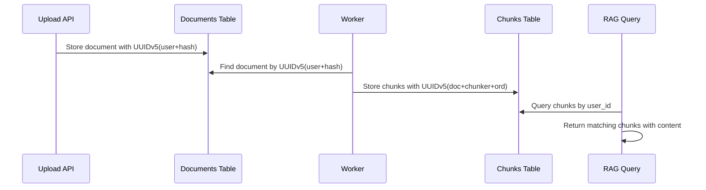

# RFC001: UUID Standardization Architecture
## Request for Comments - UUID Generation Strategy Unification

**RFC ID**: RFC001  
**Title**: UUID Standardization Architecture for Upload Pipeline  
**Authors**: Development Team  
**Date**: September 11, 2025  
**Status**: 🚨 **CRITICAL - REQUIRES IMMEDIATE IMPLEMENTATION**  
**Related**: RCA002, Phase3 Cloud Deployment Blocker

---

## Abstract

This RFC proposes a unified UUID generation strategy to resolve the critical dual UUID generation approach that is breaking the upload pipeline and RAG retrieval functionality. The current system uses random UUIDs in upload endpoints while processing workers expect deterministic UUIDs, resulting in complete pipeline failure despite no error reporting.

## Background

### Current Problem
The system employs two conflicting UUID generation strategies:
- **Upload endpoints** (`main.py`, `api/upload_pipeline/`) use `uuid.uuid4()` (random)
- **Processing workers** (`backend/workers/base_worker.py`) use `uuid.uuid5()` (deterministic)

This creates UUID mismatches that break the entire pipeline flow:
```
Upload (UUIDv4) → Parse (UUIDv5) → MISMATCH → FAILURE → Empty RAG Results
```

### Impact Assessment
- **RAG Functionality**: 100% failure rate for document retrieval
- **User Experience**: Documents upload successfully but cannot be found
- **Silent Failure**: No errors reported, making detection difficult  
- **Phase 3 Blocker**: Cannot deploy to production with broken core functionality

## Motivation

### Technical Drivers
1. **Pipeline Continuity**: Enable proper document flow from upload through RAG retrieval
2. **Data Integrity**: Ensure consistent document references across all stages
3. **Performance**: Enable content-based deduplication and caching
4. **Traceability**: Provide end-to-end UUID tracking for debugging

### Business Drivers  
1. **Phase 3 Success**: Critical requirement for cloud deployment
2. **User Satisfaction**: Restore core document upload/retrieval functionality
3. **Production Readiness**: Enable successful production validation
4. **Compliance**: Proper user association for audit trails

## Proposed Solution

### Architecture Overview

```
┌─────────────────┐    ┌──────────────────┐    ┌─────────────────┐
│   Upload API    │    │  Processing      │    │   RAG Query     │
│                 │    │  Workers         │    │                 │
│ UUIDv5          │───▶│ UUIDv5           │───▶│ UUIDv5          │
│ (user+content)  │    │ (doc+chunker+ord)│    │ (stored refs)   │
└─────────────────┘    └──────────────────┘    └─────────────────┘
        │                        │                        │
        ▼                        ▼                        ▼
┌─────────────────┐    ┌──────────────────┐    ┌─────────────────┐
│   Documents     │    │  Document        │    │  Retrieved      │
│   Table         │───▶│  Chunks          │───▶│  Content        │
│                 │    │  Table           │    │                 │
└─────────────────┘    └──────────────────┘    └─────────────────┘
```

### UUID Generation Strategy

#### **Document UUID Generation**
```python
NAMESPACE_UUID = uuid.UUID('6c8a1e6e-1f0b-4aa8-9f0a-1a7c2e6f2b42')

def generate_document_id(user_id: str, file_sha256: str) -> str:
    """Generate deterministic document UUID based on user and content."""
    canonical = f"{user_id}:{file_sha256}"
    return str(uuid.uuid5(NAMESPACE_UUID, canonical))
```

**Benefits**:
- Content-based deduplication (same document = same UUID)
- User scoping (different users get different UUIDs for same content)
- Deterministic (same input always produces same UUID)
- Collision-resistant (SHA256 hash provides uniqueness)

#### **Chunk UUID Generation**
```python
def generate_chunk_id(document_id: str, chunker_name: str, 
                     chunker_version: str, chunk_ord: int) -> str:
    """Generate deterministic chunk UUID based on document and position."""
    canonical = f"{document_id}:{chunker_name}:{chunker_version}:{chunk_ord}"
    return str(uuid.uuid5(NAMESPACE_UUID, canonical))
```

**Benefits**:
- Parent document traceability
- Chunking algorithm versioning support
- Deterministic chunk ordering
- Consistent across processing runs

### Implementation Architecture

#### **Core Components**

**1. UUID Utility Module**
```python
# utils/uuid_generation.py
import uuid
from typing import str

SYSTEM_NAMESPACE = uuid.UUID('6c8a1e6e-1f0b-4aa8-9f0a-1a7c2e6f2b42')

class UUIDGenerator:
    """Centralized UUID generation for consistent strategy across system."""
    
    @staticmethod
    def document_uuid(user_id: str, content_hash: str) -> str:
        canonical = f"{user_id}:{content_hash}"
        return str(uuid.uuid5(SYSTEM_NAMESPACE, canonical))
    
    @staticmethod  
    def chunk_uuid(document_id: str, chunker: str, version: str, ordinal: int) -> str:
        canonical = f"{document_id}:{chunker}:{version}:{ordinal}"
        return str(uuid.uuid5(SYSTEM_NAMESPACE, canonical))
    
    @staticmethod
    def job_uuid() -> str:
        # Job UUIDs can remain random as they are ephemeral
        return str(uuid.uuid4())
```

**2. Upload Endpoint Integration**
```python
# main.py - Fixed implementation
from utils.uuid_generation import UUIDGenerator

@app.post("/upload")
async def upload_document(request: UploadRequest, current_user: User):
    # Generate deterministic document UUID
    document_id = UUIDGenerator.document_uuid(
        user_id=current_user.id,  # Use actual authenticated user
        content_hash=request.sha256
    )
    
    # Job IDs remain random for tracking
    job_id = UUIDGenerator.job_uuid()
    
    # Store with proper user association
    await create_document_record(
        document_id=document_id,
        user_id=current_user.id,  # No UUID override
        job_id=job_id,
        content_hash=request.sha256
    )
```

**3. Worker Integration**
```python
# backend/workers/base_worker.py - No changes needed
# Workers already use deterministic UUID generation
# Will now find documents created by upload endpoints
```

#### **Data Flow Architecture**



### Migration Strategy

#### **Phase 1: Critical Fixes (Week 1)**
1. **Upload Endpoint UUID Generation**
   - Replace random UUIDs with deterministic generation in `main.py`
   - Update `api/upload_pipeline/` endpoints
   - Fix user ID override issue

2. **Utility Function Standardization**  
   - Create centralized UUID generation module
   - Update all UUID generation calls to use standard utilities
   - Ensure consistent namespace usage

3. **Immediate Testing**
   - Test upload-to-retrieval pipeline end-to-end
   - Validate UUID consistency across all stages
   - Confirm RAG queries return results

#### **Phase 2: Data Migration (Week 2)**
1. **Existing Data Analysis**
   - Identify documents with random UUIDs
   - Assess impact and migration complexity
   - Plan migration or regeneration strategy

2. **Migration Utilities**
   - Build UUID validation tools
   - Create data migration scripts
   - Implement rollback procedures

#### **Phase 3: Production Hardening (Week 3-4)**
1. **Monitoring and Validation**
   - Add UUID consistency monitoring
   - Implement validation checks in pipeline
   - Create alerting for UUID mismatches

2. **Performance Optimization**
   - Optimize UUID generation performance
   - Implement UUID-based caching strategies
   - Monitor impact on system performance

## Detailed Design

### API Changes

#### **Upload Endpoints**

**Before (Broken)**:
```python
# main.py:373-376
document_id = str(uuid.uuid4())  # Random - BREAKS PIPELINE
user_id = str(uuid.uuid4())      # Ignores authentication - SECURITY ISSUE
```

**After (Fixed)**:
```python
# main.py:373-376
document_id = UUIDGenerator.document_uuid(current_user.id, request.sha256)
user_id = current_user.id  # Preserve authenticated user
```

#### **Utility Functions**

**Before (Broken)**:
```python
# api/upload_pipeline/utils/upload_pipeline_utils.py
def generate_document_id() -> str:
    return str(uuid.uuid4())  # Random - INCOMPATIBLE WITH WORKERS
```

**After (Fixed)**:
```python
# api/upload_pipeline/utils/upload_pipeline_utils.py  
def generate_document_id(user_id: str, content_hash: str) -> str:
    return UUIDGenerator.document_uuid(user_id, content_hash)
```

### Database Schema Impact

**No Schema Changes Required** - Existing schema supports deterministic UUIDs:

```sql
-- upload_pipeline.documents (No changes)
CREATE TABLE upload_pipeline.documents (
    document_id uuid PRIMARY KEY,      -- Will now be deterministic
    user_id uuid NOT NULL,            -- Will now be actual user ID
    file_sha256 text NOT NULL,        -- Used in UUID generation
    -- ... other fields
);

-- upload_pipeline.document_chunks (No changes) 
CREATE TABLE upload_pipeline.document_chunks (
    chunk_id uuid PRIMARY KEY,        -- Already deterministic
    document_id uuid NOT NULL REFERENCES upload_pipeline.documents(document_id),
    -- ... other fields
);
```

### Performance Considerations

#### **UUID Generation Performance**
- **UUIDv5 vs UUIDv4**: Equivalent computational cost
- **Hashing Overhead**: Minimal SHA-1 hashing for UUID namespace
- **Caching Opportunities**: Deterministic UUIDs enable better caching

#### **Database Performance** 
- **Index Performance**: UUID indexes perform equivalently for v4/v5
- **Deduplication Benefits**: Deterministic UUIDs prevent duplicate storage
- **Query Optimization**: Predictable UUID patterns may improve query planning

#### **System Performance**
- **Positive Impact**: Content deduplication reduces storage and processing
- **Positive Impact**: Deterministic caching improves response times
- **Neutral Impact**: UUID generation time remains equivalent

### Security Analysis

#### **Privacy and Security**
- **User Isolation**: UUIDs scoped by user_id prevent cross-user access
- **Content Privacy**: SHA256 hash does not expose content
- **Deterministic Safety**: UUID collision resistance maintained
- **Access Control**: Proper user association enables permission validation

#### **Attack Vectors**
- **UUID Prediction**: UUIDs not predictable without user_id + exact content
- **Content Enumeration**: Would require knowing user_id + exact file hashes
- **Collision Attacks**: SHA-256 collision resistance provides security
- **Authorization Bypass**: User-scoped UUIDs prevent unauthorized access

#### **Compliance Impact**
- **Audit Trails**: Proper user association enables compliance tracking
- **Data Residency**: User-scoped UUIDs support data locality requirements
- **Access Logging**: Deterministic UUIDs improve audit log quality

## Alternatives Considered

### **Alternative 1: Keep Random UUIDs Everywhere**
**Rejected** - Would require significant changes to worker pipeline and lose deduplication benefits.

### **Alternative 2: Add UUID Mapping Layer**
**Rejected** - Adds complexity, performance overhead, and potential failure points.

### **Alternative 3: Hybrid Approach with Translation**
**Rejected** - Maintains dual strategy complexity and introduces translation bugs.

### **Alternative 4: Complete Pipeline Rewrite**  
**Rejected** - Too high risk and timeline impact for Phase 3 deployment.

## Implementation Timeline

### **Week 1: Critical Path Implementation**
- **Day 1-2**: Implement centralized UUID generation utilities
- **Day 3-4**: Fix upload endpoint UUID generation  
- **Day 5**: End-to-end testing and validation

### **Week 2: Integration and Migration**
- **Day 1-2**: Create data migration utilities
- **Day 3-4**: Implement UUID validation and monitoring
- **Day 5**: Production readiness testing

### **Week 3-4: Phase 3 Integration**  
- **Week 3**: Integrate with Phase 3 cloud deployment testing
- **Week 4**: Production validation and monitoring setup

## Success Metrics

### **Functional Metrics**
- **RAG Success Rate**: 100% of uploaded documents retrievable via RAG
- **Pipeline Continuity**: 100% of uploads successfully processed to chunks
- **UUID Consistency**: 100% of UUIDs follow deterministic generation

### **Performance Metrics**
- **Upload Response Time**: < 500ms for document upload with proper UUID
- **RAG Query Response**: < 2s average for document retrieval  
- **End-to-End Latency**: < 10s from upload to searchable via RAG

### **Quality Metrics**
- **Data Integrity**: 0 UUID mismatches in production
- **User Experience**: Users can find and retrieve uploaded documents
- **System Reliability**: No silent failures in upload pipeline

## Risks and Mitigation

### **Implementation Risks**
1. **Existing Data Incompatibility**: Documents with random UUIDs become orphaned
   - **Mitigation**: Data migration scripts and validation tools
2. **Pipeline Disruption**: Changes may break in-flight processing
   - **Mitigation**: Staged rollout with rollback procedures  
3. **Performance Impact**: UUID generation strategy change affects performance
   - **Mitigation**: Performance testing and monitoring

### **Deployment Risks**
1. **Phase 3 Timeline Impact**: UUID fixes may delay cloud deployment
   - **Mitigation**: Parallel implementation with Phase 3 preparation
2. **Production Validation**: Testing may not catch all edge cases
   - **Mitigation**: Comprehensive test suite and staged production rollout

## Conclusion

The UUID standardization is a **critical requirement** for Phase 3 success and overall system functionality. The proposed deterministic UUID strategy resolves the fundamental pipeline disconnect while providing benefits for deduplication, caching, and user experience.

**Implementation must begin immediately** to ensure Phase 3 cloud deployment can proceed successfully. The fix is straightforward but requires careful validation to ensure no regressions are introduced.

---

**RFC Status**: 🚨 **APPROVAL REQUIRED FOR IMMEDIATE IMPLEMENTATION**  
**Implementation Priority**: **P0 - CRITICAL BLOCKER**  
**Phase 3 Dependency**: **MUST COMPLETE BEFORE WEEK 2**