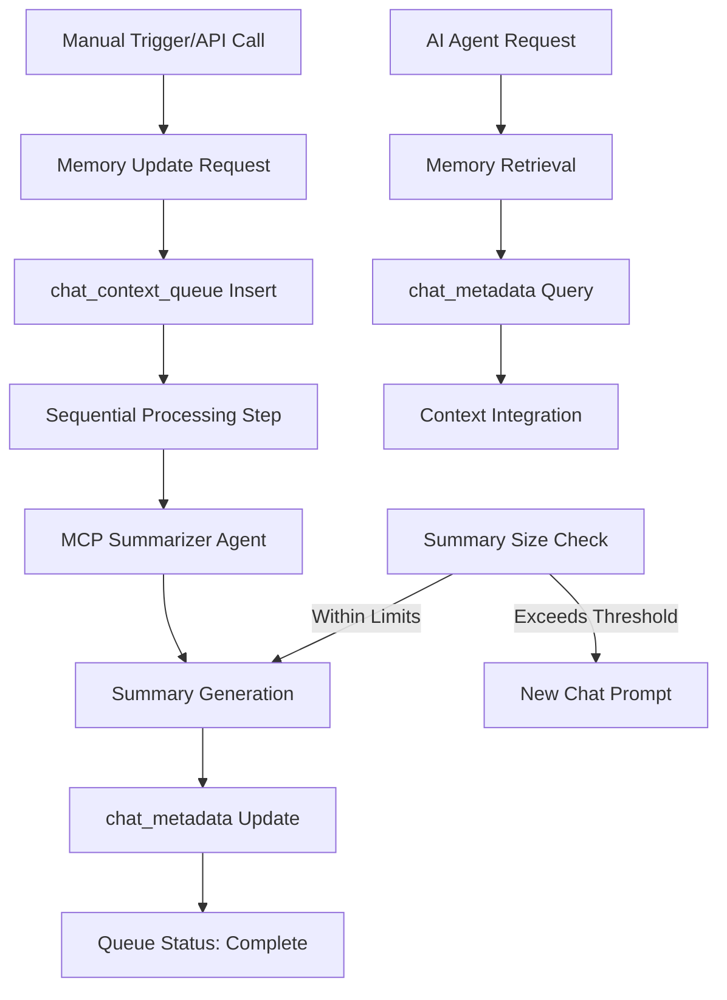

# RFC001.md — Short-Term Chat Memory MVP Technical Design

## Context & Reference

This RFC defines the technical architecture for the Short-Term Chat Memory MVP, building upon requirements established in [PRD001.md](./PRD001.md). The solution addresses the core problem of AI agent context loss within single chat sessions by implementing a lightweight, chat-scoped memory system.

**Key Requirements from PRD:**
- Store canonical summary per chat with three distinct fields: `user_confirmed`, `llm_inferred`, `general_summary`
- Achieve 95% context retention rate and 99.5% memory update reliability
- Complete memory updates within 2 seconds of trigger
- Support 10,000 concurrent active chats with graceful degradation

**Scope Note:** Input processing workflow integration is out of scope for this implementation and will be handled in a separate initiative.

## Overview

The short-term memory system implements a **manual trigger, event-driven architecture** that captures and summarizes chat context without disrupting existing agent workflows. The design emphasizes simplicity and reliability over complex features, using a sequential processing approach that can scale to render workers in the future.

**High-Level Approach:**
1. **Manual/API Triggers:** Memory updates initiated via API endpoint or manual trigger
2. **Two-Phase Processing:** MCP summarizer agent generates summaries, sequential processing step persists data
3. **Write-Ahead Logging:** `chat_context_queue` provides reliability and retry mechanisms
4. **Structured Memory:** Three-field summary structure optimizes for agent consumption

## Architecture

### System Components



### Data Architecture

#### chat_metadata Table
```sql
CREATE TABLE chat_metadata (
    chat_id UUID PRIMARY KEY REFERENCES chats(id),
    user_confirmed JSONB DEFAULT '{}',
    llm_inferred JSONB DEFAULT '{}', 
    general_summary TEXT DEFAULT '',
    token_count INTEGER DEFAULT 0,
    last_updated TIMESTAMPTZ DEFAULT NOW(),
    created_at TIMESTAMPTZ DEFAULT NOW()
);

CREATE INDEX idx_chat_metadata_chat_id ON chat_metadata(chat_id);
CREATE INDEX idx_chat_metadata_updated ON chat_metadata(last_updated);
```

#### chat_context_queue Table
```sql
CREATE TABLE chat_context_queue (
    id UUID PRIMARY KEY DEFAULT gen_random_uuid(),
    chat_id UUID NOT NULL REFERENCES chats(id),
    new_context_snippet TEXT NOT NULL,
    status VARCHAR(50) NOT NULL DEFAULT 'pending_summarization',
    created_at TIMESTAMPTZ DEFAULT NOW(),
    processed_at TIMESTAMPTZ,
    retry_count INTEGER DEFAULT 0,
    error_message TEXT
);

CREATE INDEX idx_chat_context_queue_status ON chat_context_queue(status, created_at);
CREATE INDEX idx_chat_context_queue_chat_id ON chat_context_queue(chat_id);
```

### Component Interactions

#### Memory Update Flow
1. **Trigger Phase:** Manual trigger or API call with chat_id and context snippet
2. **Queue Phase:** Insert entry into `chat_context_queue` with status `pending_summarization`
3. **Processing Phase:** Sequential processing step picks up queue entry
4. **Summarization Phase:** MCP agent generates updated memory summary
5. **Persistence Phase:** Update `chat_metadata` and mark queue entry `complete`

#### Memory Retrieval Flow
1. **Request Phase:** AI agent requests context for chat_id
2. **Query Phase:** Direct SELECT from `chat_metadata` table
3. **Integration Phase:** Agent incorporates memory fields into response context
4. **Fallback Phase:** If no memory exists, agent operates without historical context

## Technical Decisions

### Decision 1: Manual Trigger vs Automatic Integration

**Chosen Approach:** Manual trigger and API endpoint system
**Rationale:** 
- Input processing workflow is out of scope for this implementation
- Provides immediate value without complex workflow dependencies
- Clear, testable interface for memory updates
- Easy integration point for future workflow implementations

**Alternatives Considered:**
- **Event-Driven Integration:** More automated but requires workflow implementation
- **Polling System:** Less reliable and more resource intensive
- **WebSocket Updates:** Over-engineered for MVP requirements

### Decision 2: Sequential Processing vs Render Workers

**Chosen Approach:** Sequential processing step within existing process
**Rationale:** 
- Simpler implementation path for MVP
- Reduces infrastructure complexity
- Easier debugging and monitoring
- Clear migration path to render workers for scaling

**Alternatives Considered:**
- **Render Workers:** More scalable but adds complexity for MVP requirements
- **Synchronous Processing:** Simpler but blocks trigger response
- **Event Queue System:** Over-engineered for single-chat scope

### Decision 3: Write-Ahead Logging Pattern

**Chosen Approach:** `chat_context_queue` as write-ahead log
**Rationale:**
- Provides reliability without complex transaction management
- Enables retry mechanisms for failed updates
- Clear audit trail for debugging
- Supports future batch processing optimizations

**Alternatives Considered:**
- **Direct Updates:** Simpler but no reliability guarantees
- **Transaction-Based:** More complex, unnecessary for async updates
- **Event Sourcing:** Over-engineered for memory update use case

### Decision 4: MCP Summarizer Agent Architecture

**Chosen Approach:** Dedicated MCP agent following base agent pattern
**Rationale:**
- Leverages existing MCP infrastructure and patterns
- Consistent with platform architecture
- Easy to monitor and debug
- Reusable for future memory features

**Alternatives Considered:**
- **Direct API Calls:** Simpler but loses MCP benefits (monitoring, permissions)
- **Inline Processing:** Faster but harder to maintain and debug
- **External Service:** Unnecessary complexity for MVP scope

## Implementation Plan

### Phase 1: Database Schema & Core Infrastructure (Week 1)
- Create `chat_metadata` and `chat_context_queue` tables
- Implement basic CRUD operations for memory data
- Add database migrations and rollback procedures
- Create monitoring queries for queue status

### Phase 2: Manual Trigger API (Week 2)
- Implement REST API endpoint for memory update triggers
- Add context snippet validation and preprocessing
- Create manual trigger interface for testing
- Add basic authentication and rate limiting

### Phase 3: MCP Summarizer Agent (Week 3)  
- Develop MCP agent following base pattern
- Implement three-field summary generation logic
- Add token counting and size threshold checks
- Create error handling and retry mechanisms

### Phase 4: Sequential Processing Step (Week 4)
- Implement queue processing logic
- Add MCP agent invocation and result handling
- Create retry mechanisms for failed updates
- Test end-to-end memory update flow

### Phase 5: Agent Memory Access (Week 5)
- Implement memory retrieval API for agents
- Update agent templates to include memory context
- Add memory integration to existing agent workflows
- Test agent response quality improvements

### Phase 6: Edge Case Handling & Production (Week 6)
- Implement size threshold enforcement and new chat prompts  
- Add comprehensive error handling and retry logic
- Create monitoring dashboards for memory system health
- Production deployment with gradual rollout

## Risk Assessment

### High Risk: Manual Trigger Integration
**Risk:** Manual triggers don't get called consistently by developers/users
**Impact:** Memory system unused, no context retention benefits
**Mitigation:** 
- Clear documentation and integration examples
- Monitoring dashboards showing trigger usage
- Future integration with workflow system when available

### Medium Risk: Summarization Quality
**Risk:** MCP agent generates poor or inconsistent summaries
**Impact:** Reduced agent response quality, user frustration
**Mitigation:** 
- Comprehensive prompt testing with diverse chat examples
- A/B testing of summary approaches
- Fallback to stale context if new summary is significantly worse

### Medium Risk: Database Performance
**Risk:** Memory queries add unacceptable latency to agent responses
**Impact:** Slower agent response times, poor user experience
**Mitigation:**
- Aggressive database indexing strategy
- Connection pooling and query optimization
- Memory retrieval caching with invalidation

### Low Risk: Queue Processing Bottlenecks
**Risk:** Sequential processing cannot keep up with memory update volume
**Impact:** Growing queue backlogs, stale memory context
**Mitigation:**
- Comprehensive monitoring of queue depth and processing times
- Circuit breaker pattern for queue processing
- Ready migration path to render workers for scale

## Testing Strategy

### Unit Testing
- **Memory CRUD Operations:** Test all database operations with edge cases
- **API Endpoints:** Test manual trigger API with various input scenarios
- **MCP Agent Logic:** Test summarization with various input scenarios
- **Queue Processing:** Test status transitions and error handling

### Integration Testing
- **Manual Trigger Flow:** End-to-end memory update via API call
- **Agent Memory Access:** Test agents successfully retrieving and using memory
- **Error Recovery:** Test retry mechanisms and graceful degradation
- **Database Consistency:** Verify data integrity across concurrent updates

### Performance Testing
- **Concurrent Updates:** Simulate 1000+ concurrent memory updates
- **Memory Retrieval Latency:** Validate <100ms retrieval requirement
- **Database Load:** Test performance with 10,000 stored memories
- **Queue Processing Speed:** Validate 2-second update completion target

### User Acceptance Testing
- **Manual Operation:** Test developers can easily operate memory system via API
- **Context Continuity:** Verify agents reference previous conversation context
- **Summary Accuracy:** Test fact categorization (user_confirmed vs llm_inferred)
- **Error Handling:** Test user experience during system failures

## API Specification

### Memory Update Endpoint
```http
POST /api/v1/memory/update
Content-Type: application/json

{
  "chat_id": "uuid",
  "context_snippet": "string",
  "trigger_source": "manual|api|test"
}

Response: 201 Created
{
  "queue_id": "uuid",
  "status": "pending_summarization",
  "estimated_completion": "2025-08-07T12:34:58Z"
}
```

### Memory Retrieval Endpoint
```http
GET /api/v1/memory/{chat_id}

Response: 200 OK
{
  "chat_id": "uuid",
  "user_confirmed": {...},
  "llm_inferred": {...},
  "general_summary": "string",
  "last_updated": "2025-08-07T12:34:56Z"
}
```

## Performance Considerations

### Memory Update Optimization
- **Async Processing:** Never block API response for memory updates
- **Queue Batching:** Group multiple context snippets for single summarization
- **Delta Updates:** Only summarize new context changes, not full history
- **Connection Pooling:** Optimize database connection usage

### Retrieval Optimization  
- **Memory Caching:** Cache frequently accessed memories with TTL
- **Query Optimization:** Use indexed queries and avoid N+1 patterns
- **Lazy Loading:** Only retrieve memory when agents explicitly request it
- **Compression:** Compress large summaries for storage and network efficiency

### Scalability Considerations
- **Horizontal Scaling:** Design supports multiple processing instances
- **Database Sharding:** Partition by chat_id for future scaling needs  
- **Render Worker Migration:** Clear path to async workers for processing
- **Memory Archival:** Strategy for archiving old memories to maintain performance

## Monitoring & Observability

### Key Metrics
- **Memory Update Success Rate:** Target 99.5% success rate
- **Queue Processing Time:** Target <2 seconds end-to-end
- **Memory Retrieval Latency:** Target <100ms per query
- **API Usage:** Track manual trigger adoption and usage patterns

### Alerting Thresholds
- Queue depth >100 entries for >5 minutes
- Memory update success rate <99% over 15 minute window  
- Memory retrieval latency >200ms average over 5 minutes
- API error rate >5% over 10 minutes

### Dashboard Components
- Real-time queue status and processing rate
- Memory storage growth and size distribution
- Agent memory access patterns and usage
- API usage statistics and error rates

## Security Considerations

### API Security
- Authentication required for memory update endpoints
- Rate limiting to prevent abuse (100 requests/minute per user)
- Input validation and sanitization for all context snippets
- Audit logging for all memory operations

### Data Privacy
- Memory summaries follow existing data retention policies
- No sensitive information persisted beyond chat session end
- Memory access restricted to agents within same chat thread
- Secure deletion of memories when chat sessions end

## Next Steps

Upon RFC approval, the following deliverables will be created:

1. **TODO001.md:** Detailed implementation task breakdown with specific developer assignments
2. **Database Migration Scripts:** Production-ready schema changes with rollback procedures  
3. **API Documentation:** Complete API specification with examples and integration guide
4. **MCP Agent Specification:** Detailed prompt templates and behavior specifications
5. **Testing Playbook:** Comprehensive test cases and performance benchmarks

---

**Document Version:** RFC001  
**Creation Date:** 2025-08-07  
**Previous Document:** PRD001.md (Product Requirements)  
**Next Document:** TODO001.md (Implementation Tasks)  
**Technical Review Required:** Engineering team, MCP specialists, Database team  
**Integration Note:** Input processing workflow integration will be handled in separate initiative