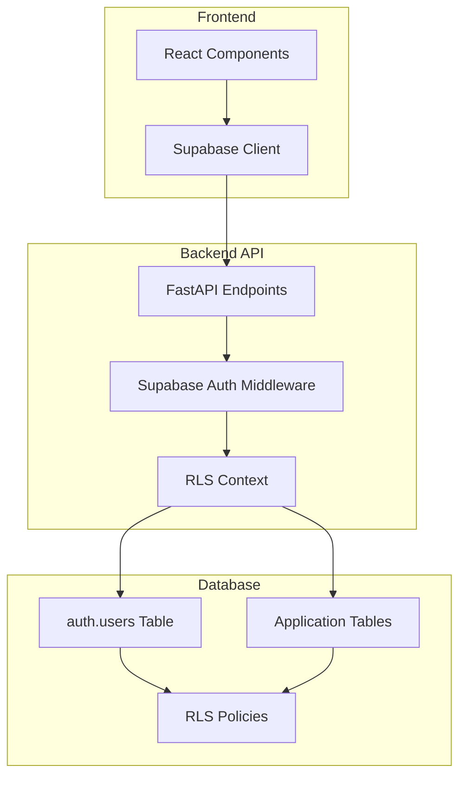

# Request for Comments: Supabase Authentication Migration

## Document Information
- **Document Type**: Request for Comments (RFC)
- **Initiative**: Supabase Authentication Migration
- **Version**: 1.0
- **Date**: 2025-01-26
- **Status**: Draft
- **Author**: Development Team
- **Reviewers**: Architecture Team, Security Team, DevOps Team

## Abstract

This RFC proposes eliminating the `public.users` table entirely and using Supabase's built-in `auth.users` table directly. The current system has a fundamental architectural conflict that creates unnecessary complexity and maintenance overhead.

## Table of Contents

1. [Motivation](#motivation)
2. [Background](#background)
3. [Proposed Solution](#proposed-solution)
4. [Technical Design](#technical-design)
5. [Implementation Plan](#implementation-plan)
6. [Migration Strategy](#migration-strategy)
7. [Security Considerations](#security-considerations)
8. [Performance Implications](#performance-implications)
9. [Risk Assessment](#risk-assessment)
10. [Alternatives Considered](#alternatives-considered)
11. [Open Questions](#open-questions)
12. [Timeline](#timeline)
13. [References](#references)

## Motivation

### Current Problems

#### 1. Architectural Conflict
The current system has a **fundamental architectural conflict**:
- Uses Supabase auth APIs (`auth.sign_in_with_password`)
- BUT maintains a separate `public.users` table
- Creates unnecessary complexity and data duplication

#### 2. RLS Policy Inconsistency
Mixed approaches to Row Level Security:
- Upload pipeline uses `auth.uid()` (correct)
- Old system uses `current_setting('app.current_user_id')` (manual)
- Creates confusion and maintenance overhead

#### 3. Data Duplication
User data exists in **both** `auth.users` AND `public.users`:
- Trigger-based synchronization creates maintenance overhead
- Potential data inconsistency between tables
- Defeats the purpose of using Supabase auth

#### 4. Maintenance Overhead
The hybrid approach creates unnecessary complexity:
- Custom user management logic
- Trigger-based synchronization
- Manual context setting
- Complex debugging and maintenance

### Business Impact

- **Development Velocity**: Architectural confusion slows development
- **Maintenance Overhead**: Complex system requires more maintenance
- **Security Risk**: Hybrid approach introduces potential vulnerabilities
- **Code Quality**: Unnecessary complexity reduces code maintainability

## Background

### Current Architecture

#### Authentication Flow
```
User Request → JWT Validation → Custom User Lookup → Database Operations
```

#### Components
- **Minimal Auth Service**: Custom authentication logic
- **Custom Users Table**: Separate from `auth.users`
- **JWT Validation**: Custom token handling
- **Database Queries**: Manual user context setting

#### Issues Identified
1. **RLS Policy Mismatch**: Custom table doesn't integrate with Supabase RLS
2. **User Context Problems**: Manual context setting is error-prone
3. **Data Inconsistency**: Users exist in custom table but not `auth.users`
4. **Security Gaps**: Custom implementation lacks enterprise security features

### Supabase Authentication Overview

#### Built-in Features
- **User Management**: Complete user lifecycle management
- **RLS Integration**: Native Row Level Security support
- **Security Features**: Password hashing, session management, rate limiting
- **API Integration**: RESTful and GraphQL APIs
- **Dashboard Management**: Admin interface for user management

#### Benefits
- **Reduced Complexity**: Eliminate custom authentication logic
- **Enhanced Security**: Industry-standard security practices
- **Better Performance**: Optimized database queries and caching
- **Easier Maintenance**: Standardized authentication patterns

## Proposed Solution

### High-Level Architecture

#### New Authentication Flow
```
User Request → Supabase Auth → RLS Context → Database Operations
```

#### Key Changes
1. **Replace Custom Auth**: Use Supabase authentication services
2. **Migrate to `auth.users`**: Move user data to Supabase's user table
3. **Update RLS Policies**: Configure policies for `auth.users` integration
4. **Simplify Codebase**: Remove custom authentication logic

### Technical Approach

#### 1. Authentication Service Migration
- Replace `improved_minimal_auth_service` with Supabase auth
- Update `auth_adapter` to use Supabase backend
- Remove custom JWT validation logic

#### 2. Database Schema Updates
- Migrate user data from custom `users` table to `auth.users`
- Update RLS policies to reference `auth.users`
- Remove custom user table dependencies

#### 3. API Integration Updates
- Update authentication endpoints to use Supabase
- Modify middleware for Supabase session handling
- Update user context management

#### 4. Frontend Integration
- Update authentication components for Supabase
- Implement Supabase client integration
- Update session management

## Technical Design

### Architecture Diagram



### Component Design

#### 1. Supabase Authentication Service
```python
class SupabaseAuthService:
    def __init__(self, supabase_client):
        self.client = supabase_client
    
    async def create_user(self, email: str, password: str) -> User:
        """Create user using Supabase auth"""
        response = self.client.auth.sign_up({
            "email": email,
            "password": password
        })
        return response.user
    
    async def authenticate_user(self, email: str, password: str) -> Session:
        """Authenticate user with Supabase"""
        response = self.client.auth.sign_in_with_password({
            "email": email,
            "password": password
        })
        return response.session
```

#### 2. RLS Context Middleware
```python
class SupabaseRLSMiddleware:
    async def __call__(self, request: Request, call_next):
        # Extract user from Supabase session
        user = await self.get_user_from_session(request)
        
        # Set RLS context
        if user:
            await self.set_rls_context(user.id)
        
        response = await call_next(request)
        return response
```

#### 3. Database Query Updates
```python
# Before: Manual user context setting
async def get_user_documents(user_id: str):
    await db.execute("SELECT set_config('app.current_user_id', $1, false)", user_id)
    return await db.fetch("SELECT * FROM documents WHERE user_id = $1", user_id)

# After: Automatic RLS context
async def get_user_documents():
    # RLS automatically filters by current user
    return await db.fetch("SELECT * FROM documents")
```

### Database Schema Changes

#### 1. User Data Migration
```sql
-- Migrate from custom users table to auth.users
INSERT INTO auth.users (id, email, encrypted_password, email_confirmed_at, created_at)
SELECT 
    id,
    email,
    crypt(password, gen_salt('bf')), -- Hash passwords
    created_at,
    created_at
FROM public.users
WHERE auth_method = 'improved_minimal_auth';
```

#### 2. RLS Policy Updates
```sql
-- Update RLS policies to use auth.uid()
CREATE POLICY user_document_access ON upload_pipeline.documents
    FOR ALL TO authenticated
    USING (user_id = auth.uid());
```

### API Endpoint Updates

#### 1. Authentication Endpoints
```python
@router.post("/register")
async def register_user(request: RegisterRequest):
    """Register user with Supabase auth"""
    try:
        response = supabase_client.auth.sign_up({
            "email": request.email,
            "password": request.password
        })
        return {"user": response.user, "session": response.session}
    except Exception as e:
        raise HTTPException(status_code=400, detail=str(e))

@router.post("/login")
async def login_user(request: LoginRequest):
    """Login user with Supabase auth"""
    try:
        response = supabase_client.auth.sign_in_with_password({
            "email": request.email,
            "password": request.password
        })
        return {"user": response.user, "session": response.session}
    except Exception as e:
        raise HTTPException(status_code=401, detail="Invalid credentials")
```

#### 2. Protected Endpoints
```python
@router.get("/me")
async def get_current_user(current_user: User = Depends(get_current_user)):
    """Get current user info from Supabase session"""
    return {
        "id": current_user.id,
        "email": current_user.email,
        "created_at": current_user.created_at
    }
```

## Implementation Plan

### Phase 1: Preparation and Setup (Week 1)

#### 1.1 Environment Configuration
- [ ] Configure Supabase project settings
- [ ] Set up authentication providers
- [ ] Configure email templates and redirects
- [ ] Set up RLS policies

#### 1.2 Development Environment
- [ ] Install Supabase client libraries
- [ ] Update environment variables
- [ ] Set up local development database
- [ ] Create migration scripts

#### 1.3 Testing Framework
- [ ] Set up authentication test suite
- [ ] Create migration test procedures
- [ ] Set up performance testing
- [ ] Configure security testing

### Phase 2: Core Implementation (Weeks 2-3)

#### 2.1 Authentication Service
- [ ] Implement Supabase authentication service
- [ ] Update auth adapter for Supabase backend
- [ ] Remove custom authentication logic
- [ ] Update JWT validation middleware

#### 2.2 Database Migration
- [ ] Create user data migration scripts
- [ ] Update RLS policies for auth.users
- [ ] Migrate existing user data
- [ ] Validate data integrity

#### 2.3 API Updates
- [ ] Update authentication endpoints
- [ ] Modify protected route middleware
- [ ] Update user context management
- [ ] Implement error handling

### Phase 3: Integration and Testing (Week 4)

#### 3.1 Frontend Integration
- [ ] Update React components for Supabase
- [ ] Implement Supabase client integration
- [ ] Update session management
- [ ] Test user workflows

#### 3.2 End-to-End Testing
- [ ] Test complete authentication flow
- [ ] Validate upload pipeline functionality
- [ ] Test RAG system integration
- [ ] Performance and load testing

#### 3.3 Security Testing
- [ ] Authentication security audit
- [ ] RLS policy validation
- [ ] Penetration testing
- [ ] Compliance verification

### Phase 4: Deployment and Migration (Week 5)

#### 4.1 Staging Deployment
- [ ] Deploy to staging environment
- [ ] User acceptance testing
- [ ] Performance validation
- [ ] Security verification

#### 4.2 Production Migration
- [ ] Production deployment
- [ ] User data migration
- [ ] Monitoring and alerting
- [ ] Rollback procedures

## Migration Strategy

### Data Migration Approach

#### 1. Export Current Data
```sql
-- Export user data from custom table
COPY (
    SELECT id, email, name, created_at, updated_at
    FROM public.users
    WHERE auth_method = 'improved_minimal_auth'
) TO '/tmp/users_export.csv' WITH CSV HEADER;
```

#### 2. Transform Data
```python
def transform_user_data(user_data):
    """Transform user data for Supabase auth.users format"""
    return {
        "id": user_data["id"],
        "email": user_data["email"],
        "raw_user_meta_data": {
            "name": user_data["name"]
        },
        "created_at": user_data["created_at"],
        "updated_at": user_data["updated_at"]
    }
```

#### 3. Import to Supabase
```python
async def migrate_users_to_supabase(users_data):
    """Migrate users to Supabase auth.users table"""
    for user_data in users_data:
        try:
            # Create user in Supabase
            response = supabase_client.auth.admin.create_user({
                "email": user_data["email"],
                "user_metadata": user_data["raw_user_meta_data"],
                "email_confirm": True
            })
            print(f"Migrated user: {user_data['email']}")
        except Exception as e:
            print(f"Failed to migrate user {user_data['email']}: {e}")
```

### Rollback Strategy

#### 1. Database Rollback
- Maintain backup of custom users table
- Keep original authentication service code
- Document rollback procedures

#### 2. Application Rollback
- Feature flags for authentication backend
- Environment variable switching
- Blue-green deployment strategy

#### 3. User Impact Mitigation
- Gradual rollout approach
- User communication plan
- Support procedures

## Security Considerations

### Authentication Security

#### 1. Password Security
- **Current**: Custom password hashing
- **Proposed**: Supabase bcrypt implementation
- **Benefit**: Industry-standard security

#### 2. Session Management
- **Current**: Custom JWT tokens
- **Proposed**: Supabase session management
- **Benefit**: Built-in security features

#### 3. Rate Limiting
- **Current**: Basic rate limiting
- **Proposed**: Supabase rate limiting
- **Benefit**: Advanced protection against abuse

### Data Security

#### 1. Row Level Security
- **Current**: Manual context setting
- **Proposed**: Automatic RLS enforcement
- **Benefit**: Consistent access control

#### 2. Data Encryption
- **Current**: Basic encryption
- **Proposed**: Supabase encryption at rest
- **Benefit**: Enhanced data protection

#### 3. Audit Logging
- **Current**: Basic logging
- **Proposed**: Comprehensive audit trails
- **Benefit**: Better security monitoring

### Compliance Considerations

#### 1. GDPR Compliance
- User data portability
- Right to deletion
- Data processing transparency

#### 2. HIPAA Compliance
- Healthcare data protection
- Audit logging requirements
- Access control enforcement

#### 3. SOC 2 Compliance
- Security controls
- Availability monitoring
- Processing integrity

## Performance Implications

### Positive Impacts

#### 1. Reduced Complexity
- **Current**: Custom authentication logic
- **Proposed**: Supabase managed service
- **Benefit**: Reduced maintenance overhead

#### 2. Optimized Queries
- **Current**: Manual user context setting
- **Proposed**: Automatic RLS context
- **Benefit**: Better query performance

#### 3. Caching
- **Current**: No authentication caching
- **Proposed**: Supabase session caching
- **Benefit**: Improved response times

### Potential Concerns

#### 1. External Dependency
- **Risk**: Supabase service availability
- **Mitigation**: Monitoring and fallback procedures

#### 2. Network Latency
- **Risk**: Additional API calls
- **Mitigation**: Local caching and optimization

#### 3. Database Load
- **Risk**: Increased auth.users queries
- **Mitigation**: Query optimization and indexing

### Performance Targets

- **Authentication Response Time**: < 200ms
- **Database Query Performance**: < 100ms
- **Concurrent User Support**: 1000+ users
- **System Availability**: 99.9%

## Risk Assessment

### High-Risk Items

#### 1. Data Loss During Migration
- **Probability**: Medium
- **Impact**: High
- **Mitigation**: Comprehensive backup and testing

#### 2. Authentication Service Downtime
- **Probability**: Low
- **Impact**: High
- **Mitigation**: Blue-green deployment

#### 3. RLS Policy Misconfiguration
- **Probability**: Medium
- **Impact**: High
- **Mitigation**: Thorough testing and validation

### Medium-Risk Items

#### 1. Performance Degradation
- **Probability**: Medium
- **Impact**: Medium
- **Mitigation**: Load testing and optimization

#### 2. User Experience Disruption
- **Probability**: Low
- **Impact**: Medium
- **Mitigation**: Gradual rollout and communication

#### 3. Integration Issues
- **Probability**: Medium
- **Impact**: Medium
- **Mitigation**: Comprehensive testing

### Low-Risk Items

#### 1. Feature Limitations
- **Probability**: High
- **Impact**: Low
- **Mitigation**: Feature gap analysis

#### 2. Learning Curve
- **Probability**: High
- **Impact**: Low
- **Mitigation**: Training and documentation

## Alternatives Considered

### Alternative 1: Fix Current System
**Description**: Keep minimal auth but fix RLS issues
**Pros**:
- Minimal code changes
- Faster implementation
- Preserve existing functionality

**Cons**:
- Doesn't address technical debt
- Still not production-ready
- Ongoing maintenance burden
- Security concerns remain

**Decision**: Rejected - doesn't solve root problems

### Alternative 2: Custom Supabase Integration
**Description**: Build custom integration with Supabase
**Pros**:
- Full control over implementation
- Custom features possible
- Gradual migration approach

**Cons**:
- High development effort
- Complex maintenance
- Potential security issues
- Longer timeline

**Decision**: Rejected - too complex and risky

### Alternative 3: Third-Party Auth Service
**Description**: Use Auth0, Firebase Auth, or similar
**Pros**:
- Mature authentication service
- Rich feature set
- Good documentation

**Cons**:
- Additional cost
- Vendor lock-in
- Integration complexity
- Data sovereignty concerns

**Decision**: Rejected - Supabase already provides auth

### Alternative 4: Supabase Auth Migration (Proposed)
**Description**: Migrate to Supabase's built-in auth
**Pros**:
- Native integration
- Production-ready
- Reduces technical debt
- Better security
- Cost-effective

**Cons**:
- Migration effort required
- Learning curve
- Potential temporary disruption

**Decision**: Selected - best long-term solution

## Open Questions

### Technical Questions

1. **Password Migration**: How to handle existing password hashes?
   - **Answer**: Reset passwords or use Supabase admin API

2. **Session Continuity**: How to maintain user sessions during migration?
   - **Answer**: Gradual rollout with session migration

3. **RLS Policy Complexity**: How complex are the RLS policies?
   - **Answer**: Need to audit and simplify policies

4. **Performance Impact**: What's the performance impact of RLS?
   - **Answer**: Minimal with proper indexing

### Business Questions

1. **User Communication**: How to communicate changes to users?
   - **Answer**: Email notification and in-app messaging

2. **Rollback Timeline**: How quickly can we rollback if needed?
   - **Answer**: 15 minutes with blue-green deployment

3. **Feature Parity**: What features will be lost/gained?
   - **Answer**: Gain enterprise features, lose some custom logic

4. **Cost Impact**: What's the cost impact of migration?
   - **Answer**: Minimal - using existing Supabase subscription

### Operational Questions

1. **Monitoring**: How to monitor the new system?
   - **Answer**: Supabase dashboard + custom monitoring

2. **Support**: How to handle user support during migration?
   - **Answer**: Enhanced support team + documentation

3. **Training**: What training is needed for the team?
   - **Answer**: Supabase documentation + hands-on training

4. **Documentation**: What documentation needs updating?
   - **Answer**: API docs, user guides, admin procedures

## Timeline

### Detailed Schedule

#### Week 1: Preparation
- **Days 1-2**: Environment setup and configuration
- **Days 3-4**: Migration script development
- **Days 5-7**: Testing framework setup

#### Week 2: Core Development
- **Days 1-3**: Authentication service implementation
- **Days 4-5**: Database migration scripts
- **Days 6-7**: API endpoint updates

#### Week 3: Integration
- **Days 1-3**: Frontend integration
- **Days 4-5**: End-to-end testing
- **Days 6-7**: Performance optimization

#### Week 4: Testing and Validation
- **Days 1-3**: Comprehensive testing
- **Days 4-5**: Security testing
- **Days 6-7**: User acceptance testing

#### Week 5: Deployment
- **Days 1-2**: Staging deployment
- **Days 3-4**: Production migration
- **Days 5-7**: Monitoring and support

### Milestones

- **Week 1**: Environment ready for development
- **Week 2**: Core authentication working
- **Week 3**: Full integration complete
- **Week 4**: Testing and validation complete
- **Week 5**: Production deployment complete

## References

### Technical Documentation
- [Supabase Authentication Guide](https://supabase.com/docs/guides/auth)
- [Supabase RLS Policies](https://supabase.com/docs/guides/auth/row-level-security)
- [Supabase Client Libraries](https://supabase.com/docs/reference/javascript)

### Industry Standards
- [OWASP Authentication Cheat Sheet](https://cheatsheetseries.owasp.org/cheatsheets/Authentication_Cheat_Sheet.html)
- [JWT Best Practices](https://tools.ietf.org/html/rfc8725)
- [Password Security Guidelines](https://pages.nist.gov/800-63-3/sp800-63b.html)

### Internal Documentation
- [Current Authentication System](docs/technical/auth_system.md)
- [Technical Debt Assessment](docs/technical_debt/EMAIL_AUTHENTICATION_DEBT.md)
- [Database Schema Documentation](docs/database/schema.md)

---

**Review and Approval**

- [ ] Architecture Team Review: _________________ Date: _______
- [ ] Security Team Review: ____________________ Date: _______
- [ ] DevOps Team Review: ______________________ Date: _______
- [ ] Engineering Lead Approval: ________________ Date: _______
- [ ] Product Owner Approval: ___________________ Date: _______
