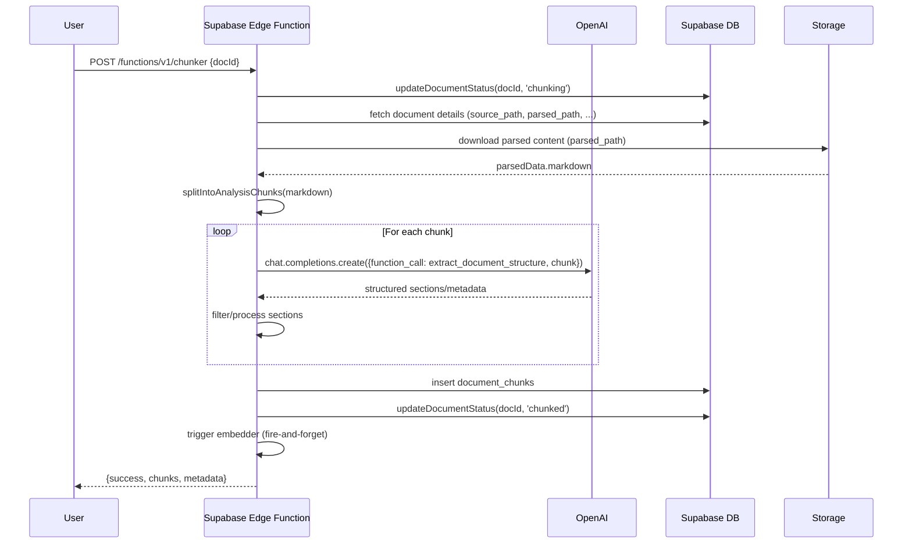

# Document Chunker Edge Function: Status & FMEA

## System Sequence Diagram

---

## Project Goals
- Reliably chunk large documents into semantically meaningful sections for downstream embedding and retrieval.
- Use OpenAI function calling to enforce structured output and robust section extraction.
- Integrate with Supabase storage and database for document management.
- Handle large, complex documents with hierarchical structure.

## Tools & Libraries Used

- **Supabase Edge Functions** (Deno runtime)
- **OpenAI API** (function calling, GPT-4-turbo-preview)
- **Supabase JS Client** (database and storage access)
- **Zod** (schema validation)
- **Mermaid** (diagramming)

## Current Workflow Summary
- Receives a document ID via HTTP POST.
- Fetches document metadata and parsed content from Supabase.
- Splits the document into section-aware analysis chunks.
- For each chunk, calls OpenAI with function calling to extract structured sections.
- Filters and processes sections, skipping empty or malformed ones.
- Inserts resulting chunks into the database.
- Updates document status and triggers embedding.
- Returns a summary response to the user.

## FMEA: Unresolved Issues

| Failure Mode                        | Effect                                 | Cause/Trigger                | Current Controls         | Severity | Occurrence | Detection | RPN  | Recommendations                  |
|-------------------------------------|----------------------------------------|------------------------------|-------------------------|----------|------------|-----------|------|-----------------------------------|
| Edge function timeout               | Incomplete chunking, user confusion    | Large docs, slow OpenAI API  | Logging, chunk splitting| 9        | 8          | 5         | 360  | Parallelize, background jobs      |
| OpenAI rate/size limit (429 error)  | Chunking fails, no output              | Large input, API limits      | Pre-chunking, error logs| 8        | 7          | 6         | 336  | Reduce chunk size, retry/backoff  |
| Empty/malformed section in output   | Data loss, incomplete structure        | LLM hallucination, bad input | Filtering, warnings     | 6        | 6          | 7         | 252  | Prompt tuning, post-process merge |
| Slow per-chunk processing           | Timeout, high latency                  | LLM speed, sequential calls  | Logging                 | 7        | 8          | 4         | 224  | Parallelize, async batching       |
| Storage/database write failure      | Data loss, status stuck                | Network, quota, schema error | Error handling          | 8        | 3          | 6         | 144  | Retry, alert, transactional write |
| OpenAI hallucinated structure       | Wrong chunking, user confusion         | LLM error, ambiguous prompt  | Zod validation, logging | 7        | 5          | 5         | 175  | Prompt tuning, fallback logic     |

- **RPN = Severity × Occurrence × Detection**

## Recommendations / Next Steps
- **Parallelize OpenAI calls** to reduce total processing time and avoid timeouts.
- **Implement background/job-based chunking** for very large documents.
- **Add progress reporting** so users can see chunking status in real time.
- **Tune prompts and post-processing** to reduce empty/malformed sections.
- **Add retry/backoff logic** for OpenAI rate/size limit errors.
- **Monitor and alert** on failures and slow jobs.

---

*Last updated: $(date)* 