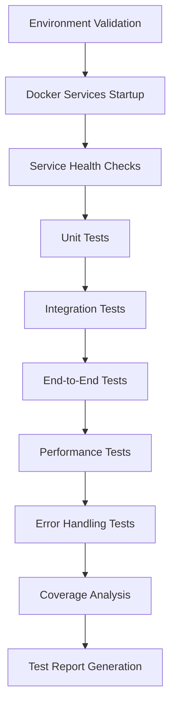

# Phase 1 Workflow Testing - Complete Guide

## Overview

This document provides comprehensive guidance for executing Phase 1 workflow testing as specified in the `workflow_testing_spec.md`. Phase 1 focuses on **Local Docker-based testing with production Supabase integration**.

## What is Phase 1 Testing?

Phase 1 testing validates the complete upload pipeline using:
- **Local Docker containers** for API, Worker, and Frontend services
- **Production Supabase** for database, authentication, and storage
- **Mock external services** (LlamaParse, OpenAI) for cost control
- **Comprehensive test coverage** including unit, integration, and end-to-end tests

## Prerequisites

### Required Software
- Docker and Docker Compose
- Python 3.8+ (for advanced testing)
- Node.js 18+ (for frontend testing)
- Git

### Required Files
- `.env.production` - Production Supabase credentials
- `docker-compose.phase1-workflow-testing.yml` - Phase 1 Docker configuration
- Test scripts in `scripts/testing/`

### Required Credentials
- Production Supabase URL and keys
- Database connection details
- API keys for external services (if using real APIs)

## Quick Start

### 1. Environment Setup

```bash
# Navigate to project root
cd /path/to/insurance_navigator

# Create production environment file
cp env.production.example .env.production
# Edit .env.production with your production Supabase credentials

# Make test scripts executable
chmod +x scripts/execute_phase1_workflow_testing.sh
chmod +x scripts/testing/phase1-workflow-testing.sh
chmod +x scripts/testing/phase1-workflow-testing.py
```

### 2. Run Phase 1 Testing

```bash
# Execute complete Phase 1 testing
./scripts/execute_phase1_workflow_testing.sh

# Or run specific components
./scripts/execute_phase1_workflow_testing.sh --preflight  # Check prerequisites
./scripts/execute_phase1_workflow_testing.sh --setup      # Set up environment
./scripts/execute_phase1_workflow_testing.sh --cleanup    # Clean up
```

## Test Architecture

### Docker Services

| Service | Port | Purpose | Health Check |
|---------|------|---------|--------------|
| API Server | 8000 | Upload pipeline API | `/health` |
| Worker Service | 8002 | Background job processing | `/health` |
| Frontend | 3000 | Web interface | `/health` |
| Monitoring | 3001 | Health monitoring | `/health` |
| Mock LlamaParse | 8001 | Document parsing simulation | `/health` |
| Mock OpenAI | 8002 | AI processing simulation | `/health` |

### Test Flow



## Test Phases

### Phase 1.1: Environment Validation
- ✅ Check `.env.production` exists
- ✅ Verify Docker is running
- ✅ Validate Docker Compose file
- ✅ Check required test scripts

### Phase 1.2: Docker Services Startup
- ✅ Stop existing services
- ✅ Build Docker images
- ✅ Start all services
- ✅ Wait for health checks

### Phase 1.3: Service Health Checks
- ✅ API Server health
- ✅ Worker Service health
- ✅ Frontend Service health
- ✅ Monitoring Service health
- ✅ Production Supabase connectivity

### Phase 1.4: Unit Tests
- ✅ API service unit tests
- ✅ Worker service unit tests
- ✅ Frontend unit tests
- ✅ Coverage analysis

### Phase 1.5: Integration Tests
- ✅ Service-to-service communication
- ✅ Database integration
- ✅ Frontend simulation tests
- ✅ External service integration

### Phase 1.6: End-to-End Tests
- ✅ Complete document upload workflow
- ✅ Job status monitoring
- ✅ Processing pipeline validation
- ✅ Data persistence verification

### Phase 1.7: Performance Tests
- ✅ Concurrent processing
- ✅ API response times
- ✅ Resource utilization
- ✅ Load testing

### Phase 1.8: Error Handling Tests
- ✅ Invalid file size handling
- ✅ Invalid MIME type handling
- ✅ Rate limiting
- ✅ Service failure recovery

## Test Scripts

### Primary Execution Script
```bash
./scripts/execute_phase1_workflow_testing.sh
```
- Orchestrates complete Phase 1 testing
- Handles environment setup and cleanup
- Generates comprehensive test reports
- Provides detailed logging

### Bash Testing Script
```bash
./scripts/testing/phase1-workflow-testing.sh
```
- Fast, lightweight testing
- Uses curl and bash only
- Good for quick validation
- CI/CD friendly

### Python Testing Script
```bash
python3 scripts/testing/phase1-workflow-testing.py
```
- Comprehensive async testing
- Advanced error handling
- Detailed metrics collection
- JSON report generation

### Frontend Simulation Script
```bash
./scripts/testing/test-frontend-simulation.sh
```
- Simulates frontend behavior
- Tests API integration points
- Validates complete workflows
- No frontend server required

## Configuration

### Docker Compose Configuration
The Phase 1 Docker Compose file (`docker-compose.phase1-workflow-testing.yml`) includes:

- **API Service**: Containerized upload pipeline with production Supabase
- **Worker Service**: Background job processing with mock external services
- **Frontend Service**: Web interface for testing
- **Mock Services**: LlamaParse and OpenAI simulators for cost control
- **Monitoring Service**: Health monitoring and metrics

### Test Configuration
Configuration is managed in `config/testing/phase1_workflow_testing.yaml`:

- Service URLs and ports
- Test parameters and thresholds
- Performance criteria
- Coverage goals
- Reporting settings

## Test Data

### Test Documents
- `examples/simulated_insurance_document.pdf` (1.7KB)
- `examples/scan_classic_hmo_parsed.pdf` (2.4MB)

### Test Scenarios
- **Happy Path**: Normal document upload and processing
- **Error Cases**: Invalid files, rate limiting, service failures
- **Edge Cases**: Large files, concurrent uploads, network issues
- **Performance**: Load testing, response time validation

## Expected Results

### Success Criteria
- ✅ All services start and pass health checks
- ✅ Unit tests achieve ≥80% code coverage
- ✅ Integration tests validate service communication
- ✅ End-to-end tests complete successfully
- ✅ Performance tests meet baseline requirements
- ✅ Error handling tests validate recovery mechanisms

### Performance Baselines
- API response time: <1000ms
- Document processing: <5 minutes
- Concurrent uploads: 10+ simultaneous
- Success rate: ≥80%

### Coverage Targets
- Overall code coverage: ≥80%
- Critical path coverage: ≥95%
- API endpoints: 100% tested
- Error scenarios: 100% covered

## Troubleshooting

### Common Issues

#### Services Won't Start
```bash
# Check Docker status
docker info

# Check logs
docker-compose -f docker-compose.phase1-workflow-testing.yml logs

# Restart services
docker-compose -f docker-compose.phase1-workflow-testing.yml restart
```

#### Health Checks Failing
```bash
# Check individual service health
curl http://localhost:8000/health
curl http://localhost:8002/health
curl http://localhost:3000/health

# Check service logs
docker-compose -f docker-compose.phase1-workflow-testing.yml logs api-server
```

#### Database Connection Issues
```bash
# Verify Supabase connectivity
curl -H "apikey: YOUR_ANON_KEY" https://YOUR_PROJECT.supabase.co/rest/v1/

# Check environment variables
cat .env.production
```

#### Test Failures
```bash
# Run with verbose logging
export LOG_LEVEL=DEBUG
./scripts/testing/phase1-workflow-testing.sh

# Check test logs
tail -f phase1_test_results.log
```

### Debug Mode
```bash
# Enable debug logging
export LOG_LEVEL=DEBUG

# Run specific test phase
./scripts/testing/phase1-workflow-testing.sh --debug

# Check Docker service logs
docker-compose -f docker-compose.phase1-workflow-testing.yml logs -f
```

## Test Reports

### Generated Reports
- `phase1_test_report.json` - Comprehensive test results
- `phase1_test_results.log` - Detailed execution logs
- `coverage/` - Code coverage reports
- `test_reports/` - Additional test artifacts

### Report Contents
- Test execution summary
- Pass/fail statistics
- Performance metrics
- Coverage analysis
- Error details and stack traces
- Recommendations for improvements

## Integration with CI/CD

### GitHub Actions
```yaml
- name: Run Phase 1 Testing
  run: |
    chmod +x scripts/execute_phase1_workflow_testing.sh
    ./scripts/execute_phase1_workflow_testing.sh
```

### GitLab CI
```yaml
test_phase1:
  script:
    - chmod +x scripts/execute_phase1_workflow_testing.sh
    - ./scripts/execute_phase1_workflow_testing.sh
  artifacts:
    reports:
      junit: test-results.xml
```

### Jenkins Pipeline
```groovy
stage('Phase 1 Testing') {
    steps {
        sh 'chmod +x scripts/execute_phase1_workflow_testing.sh'
        sh './scripts/execute_phase1_workflow_testing.sh'
    }
}
```

## Next Steps

After successful Phase 1 completion:

1. **Phase 2**: Cloud deployment testing (Render.com + Vercel)
2. **Phase 3**: End-to-end integration validation
3. **Production Readiness**: Final production deployment validation

## Support

### Documentation
- `workflow_testing_spec.md` - Complete testing specification
- `TESTING_INFRASTRUCTURE.md` - Testing infrastructure details
- `PHASE2_QUICK_REFERENCE.md` - Phase 2 testing guide

### Getting Help
1. Check the logs for error details
2. Review the test report for specific failures
3. Consult the troubleshooting section
4. Contact the development team for assistance

## Conclusion

Phase 1 workflow testing provides comprehensive validation of the upload pipeline using local Docker services with production Supabase integration. This approach ensures:

- **Complete functionality validation** without production deployment
- **Cost-effective testing** using mock external services
- **Comprehensive coverage** of all critical paths
- **Reliable automation** for CI/CD integration
- **Detailed reporting** for continuous improvement

The testing infrastructure is designed to be maintainable, scalable, and easy to use, providing a solid foundation for subsequent testing phases and production deployment validation.
